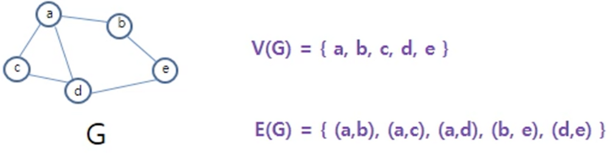
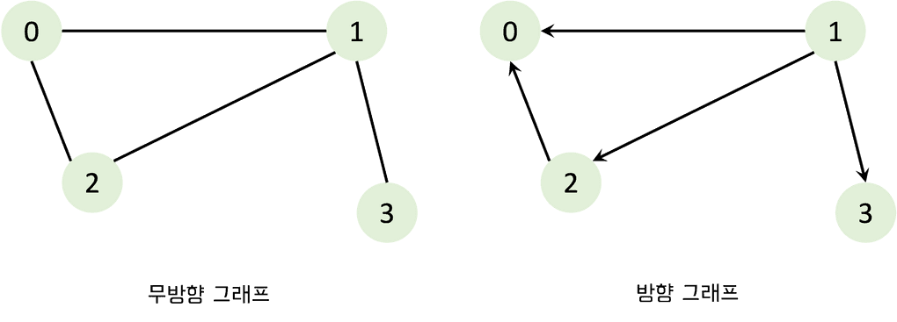
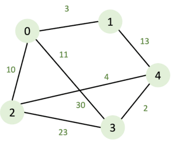
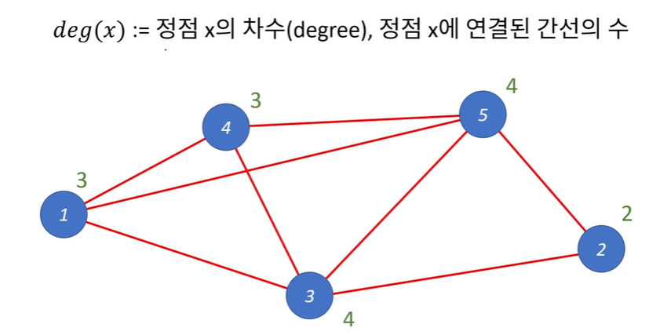
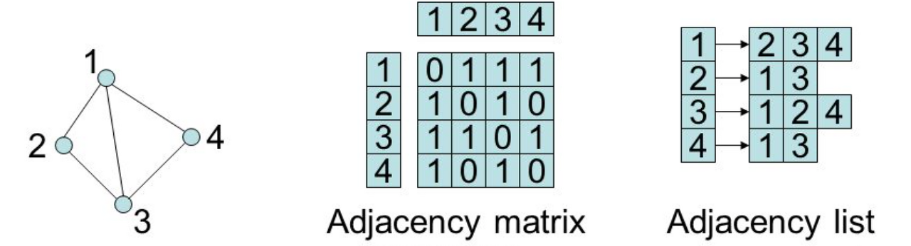
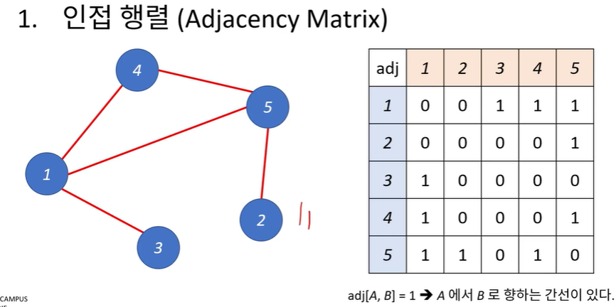
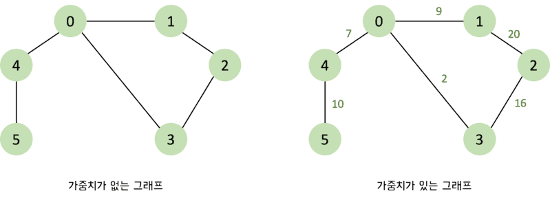
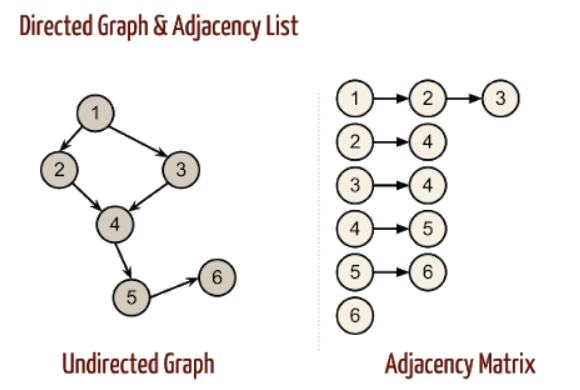
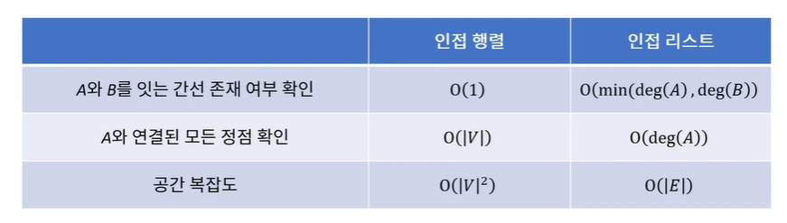

# 그래프와 탐색

Graph는 정점(Vertex) + 간선(Edge)으로 구성되어 있습니다.

## 정점(Vertex, Node)

- 어떤 대상의 객체

## 간선(Edge)

- vertex간의 관계



---

## 방향 그래프, 무방향 그래프



정점 A와 정점 B를 잇는 간선을 (A, B)라고 하는데 `무방향 그래프`에서는 (A, B) (B, A)가 `같은 간선`이 됩니다.

`방향 그래프`는 간선에 방향이 존재하는 그래프로 간선을 통해 한쪽으로만 갈 수 있다. (A, B) (B, A)는 `다른 간선`이 된다.

---

## 가중 그래프(Weighted graph), 가중 네트워크(Weighted network)



간선에 가중치를 할당하여 `정점 간의 연결 유무` 뿐만 아니라 `연결 강도`까지 나타낼 수 있으므로 보다 복잡한 관계를 표현할 수 있는 그래프입니다.

---

## Degree(정점의 차수)



1번 정점에는 3개(4,5,3)가 연결 되어 있으니 정점1의 차수는 3이 됩니다. (3, 2번 정점은 2개..)

**모든 정점의 차수의 합 = 간선의 개수의 2배**

---

## 그래프를 저장하는 방법

프로그래밍에서 그래프는 크게 2가지 방식으로 표현할 수 있는데 **인접 행렬(adjacency matrix)**과 **인접 리스트(adjacency list)**입니다.



---

### 인접 행렬(Adjacency Matrix)

인접 행렬은 `2차원 배열`로 각 노드의 연결 관계를 표현하는 방식입니다. 인접 행렬 방식을 사용하면 노드의 연결 관계를 담은 배열이 중앙 대각선을 기준으로 대칭을 이루게 됩니다.




노드에 대해 가중치가 있을 때는 아래와 같이 `가중치를 입력`해주고 가중치가 없는 경우에는 `1`과 `0`으로 표기합니다.

```jsx
// 가중치가 없는 인접 행렬 그래프
const graph = [
  [0, 1, 0, 1, 1, 0],
  [1, 0, 1, 0, 0, 0],
  [0, 1, 0, 1, 0, 0],
  [1, 0, 1, 0, 0, 0],
  [1, 0, 0, 0, 0, 1],
  [0, 0, 0, 0, 1, 0],
];

// 가중치가 있는 인접 행렬 그래프
const INF = Number.MAX_SAFE_INTEGER;

const weighted_graph = [
  [0, 9, INF, 2, 7, INF],
  [9, 0, 20, INF, INF, INF],
  [INF, 20, 0, 16, INF, INF],
  [2, INF, 16, 0, INF, INF],
  [7, INF, INF, INF, 0, 10],
  [INF, INF, INF, INF, 10, 0],
];
```

### 인접 리스트(Adjacency list)

그래프의 연결 관계를 표현하는 방식으로 모든 노드에 연결 정보를 차례대로 연결하여 저장합니다.

연결되어 있는 경우에만 저장



```jsx
// 가중치가 없는 인접 리스트 그래프
const graph = [[1, 3, 4], [0, 2], [1, 3], [0, 2], [0, 5], [4]];

// 가중치가 있는 인접 리스트 그래프
const weighted_graph = [
  [
    [1, 9],
    [3, 2],
    [4, 7],
  ],
  [
    [0, 9],
    [2, 20],
  ],
  [
    [1, 20],
    [3, 16],
  ],
  [
    [0, 2],
    [2, 16],
  ],
  [
    [0, 7],
    [5, 10],
  ],
  [[4, 10]],
];
```

### 인접 행렬 방식과 인접 리스트 방식의 차이점

`인접 행렬 방식`은 노드의 모든 관계를 저장하므로 메모리를 불필요하게 많이 사용하게 됩니다. 반면 `인접 리스트 방식`은 연결된 정보만을 저장하기 때문에 메모리를 효율적이게 사용합니다. 하지만 `인접 리스트 방식`은 연결된 데이터를 하나씩 확인해야 하므로 인접 행렬 방식에 비해 특정한 두 노드의 연결에 대한 정보를 얻는 속도가 느립니다.

즉, **그래프의 노드의 개수가 많을 때는 인접 리스트**를 쓰고, **노드 개수가 100개 이하면 인접 행렬**을 사용해도 됩니다.



## 그래프 문제의 핵심

- 정점(Vertex) & 간선(Edge)에 대한 `정확한 정의`
- 간선 저장 방식을 확인하기

# DFS(Depth First Search)

- 깊이 우선 탐색
- DFS를 구현하는 데는 2가지 방법이 있습니다. 첫번째는 `재귀`를 이용하는 것이고, 두번째는 `스택(반복문)`을 이용하는 것입니다.

## DFS 구현

### 재귀를 이용한 DFS(Recursie DFS)

동작방식

1. 방문 여부를 기록하기 위해 배열 visited를 사용하며, 배열 visited값을 false로 초기화한다.
2. 노드를 방문할 때마다 해당 노드의 visited 배열 값을 true로 변경한다.
3. 해당 노드(v)와 연결된 노드 중에 방문하지 않은 노드(node)가 있다면 방문하지 않은 노드를 시작점으로 하여 DFS를 다시 시작한다.

```jsx
function dfs(graph, v, visited) {
  // 현재 노드를 방문 처리
  visited[v] = true;
  console.log(v);

  // 현재 노드와 연결된 다른 노드를 재귀적으로 방문
  for (let node of graph[v]) {
    if (!visited[node]) {
      dfs(graph, node, visited);
    }
  }
}

const graph = [[1, 2, 3], [0, 6], [0], [0, 4, 5], [3], [3], [1]];
const visited = Array(6).fill(false);

dfs(graph, 0, visited);
```

### 스택을 이용한 DFS(Iterative DFS)

동작방식

1. 스택에 시작 노드를 push 한다.
2. 스택에서 노드를 pop하고 해당 노드(v)가 방문하지 않는 노드라면 방문처리 한다.
3. 노드(v)와 연결된 노드 중에서 방문하지 않은 노드(node)가 있다면 stack에 push한다.
4. stack의 길이가 0이 될 때까지 `2, 3 과정`을 반복한다.

[과정은 여기 참고](https://chamdom.blog/dfs-using-js/)

### WHEN

- `모든 정점을 방문`하는 것이 주요한 문제일 때 사용
- `경로의 특징`을 저장해둬야 하는 문제
  예를들면, 각 정점에 숫자가 적혀있고 a부터 b까지 가는 경로를 구하는데 경로에 같은 숫자가 있으면 안된다는 문제나 각각의 경로마다 특징을 저장해둬야 할 때는 DFS 사용

---

## BFS(Breath First Search)

- 너비 우선 탐색
- queue를 사용하는 것이 일반적
- JS는 queue가 내장되어 있지 않기 때문에 직접 자료구조를 구현해야 합니다.

동작방식

1. 탐색 시작 노드를 큐에 삽입하고 방문 처리한다.
2. 큐에서 노드를 꺼내 해당 노드의 인접 노드 중에서 방문하지 않은 노드를 모두 큐에 삽입하고 방문 처리한다.
3. `2`번의 과정을 더 이상 수행할 수 없을 때까지 반복한다.

```jsx
function bfs(graph, start, visited) {
  // const queue = new Queue();
  const queue = [];
  queue.push(start);
  visited[start] = true;

  while (queue.length !== 0) {
    const v = queue.shift();
    console.log(v);

    for (const node of graph[v]) {
      if (!visited[node]) {
        queue.push(node);
        visited[node] = true;
      }
    }
  }
}

const graph = [[1, 2, 4], [0, 5], [0, 5], [4], [0, 3], [1, 2]];
const visited = Array(6).fill(false);
bfs(graph, 0, visited);
// 0 1 2 4 5 3
```

### WHEN

- `모든 정점을 방문`하는 것이 주요한 문제일 때 사용
- `최단거리`를 구해야 하는 문제
  미로 찾기 등 최단거리를 구해야 할 경우, BFS가 유리합니다. 왜냐하면 DFS로 경로를 검색할 경우 처음으로 발견되는 해답이 최단거리가 아닐 수 있지만, BFS는 현재 노드에서 가까운 곳부터 찾기때문에 해답이 곧 최단거리입니다.

---

## 시간복잡도

깊이 우선 탐색(Depth First Search), 너비 우선 탐색(Breadth First Search)의 시간복잡도는 같습니다.

- 인접 행렬: O(V^2)
- 인접 리스트: O(deg(1) + deg(2) + … + dev(V)) = O(E)

---

### Reference

[https://chamdom.blog/graph/](https://chamdom.blog/graph/)

[https://chamdom.blog/dfs-using-js/](https://chamdom.blog/dfs-using-js/)
