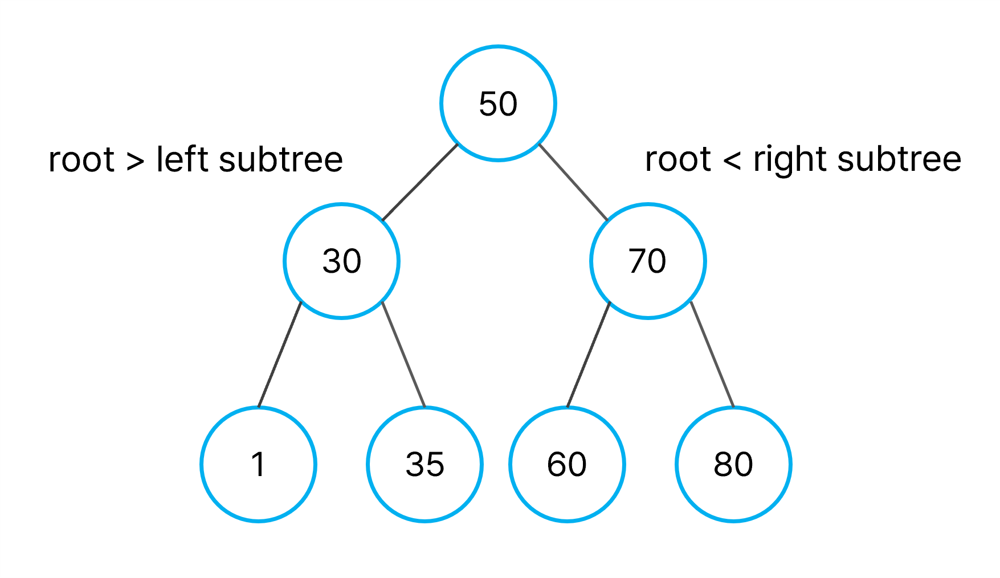
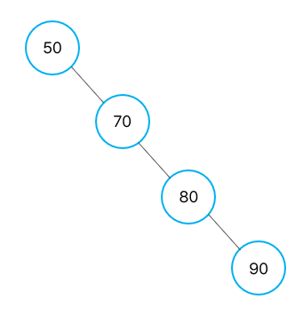

## 이진 탐색 트리(BST, Binary Search Tree)

- 노드의 왼쪽 하위 트리에는 노드의 키보다 작은 키가 있는 노드만 포함된다.
- 노드의 오른쪽 하위 트리에는 노드의 키보다 큰 키가 있는 노드만 포함된다.
- 왼쪽 및 오른쪽 하위 트리도 각각 이진 검색 트리어야 한다.
- 중복된 키를 허용하지 않는다.

## Heap vs BST

|                              | Heap                                                 | BST                         |
| ---------------------------- | ---------------------------------------------------- | --------------------------- |
| 정렬 기준                    | 상위 노드의 값이 하위 노드의 값보다 작나는 것만 보장 | Heap과 다르게 순서를 보장   |
| 시간 복잡도                  | 검색, 삽입, 삭제 = O(log n)                          | 검색, 삽입, 삭제 = O(log n) |
| 최대/최소값 검색 시간 복잡도 | O(1)                                                 | O(log n)                    |

결론은, 최대, 최소값만을 찾고자 한다면 `Heap`
을 사용하고, 모든 값을 정렬하고 싶다면 `BST`
를 사용하면된다.

### BST의 worst case

한쪽으로 쏠린 트리인 편향 트리(degenerated tree)일 때 발생한다. 이것을 해결하기 위해 균형을 맞춰 주어야 한다. 그때 사용할 수 있는 자료구조가 AVL 트리이다. 편향 트리를 AVL 트리로 재구성하면 어떤 노드를 탐색하든 O(log N)에 탐색할 수 있다.

### AVL 트리

- 이진 탐색 트리의 속성을 가진다.
- 왼쪽, 오른쪽 서브 트리의 높이 차이가 `최대 1`이다.
- 높이 차이가 1보다 커지면 `회전`을 통해 균형을 맞춰 높이 차이를 줄인다.
- 삽입, 검색, 삭제의 시간복잡도가 `O(log N)`이다.
