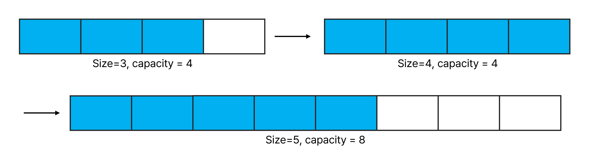
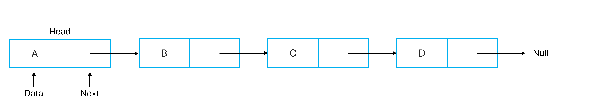

## Array(배열)

여러 데이터를 연속된 메모리에 저장할 때 사용하는 자료 구조로써 논리적 저장 순서와 물리적 저장 순서가 일치한다.

### 배열의 장점

- 인덱스로 해당 원소에 접근이 가능하다.(O(1))

### 배열의 단점

- 삽입, 삭제가 번거롭다. 한칸씩 옮겨야하기 때문에 O(n)의 시간복잡도를 가진다.
- 초기에 배열의 크기를 지정해야 하며, 고정적이고 변경할 수 없다.

## 동적 배열(Dynamic Array)

데이터가 커져야 하면 배열의 용량이 자동으로 늘어나는 자료구조로써 용량이 가득 찼을 때 새로운 원소가 추가되어야할 경우, 용량이 2배로 늘어나며 계속해서 추가 할당을 할 수 있다.

### 동적 배열의 장점

- 배열의 크기가 유동적이다
- 인덱스 값을 이용하여 접근이 가능하다.

### 동적 배열의 단점

- 삽입, 삭제가 번거롭다.

## 연결 리스트(Linked List)

어떠한 노드가 데이터와 다음 노드에 대한 주소정보(포인터)를 가지고 노드들끼리 순차적으로 연결되어 있는 방식의 자료구조

### 연결 리스트의 장점

- 삽입, 삭제가 빠르다.
- 필요할때 크기를 늘리거나 줄일 수 있어서 메모리 관리가 효율적이다.

### 연결 리스트의 단점

- 메모리 연속성을 가지지 않기 때문에 랜덤 접근이 불가능하다
- 검색시 처음 노드부터 순차적으로 순회해야 한다.
- 배열보다 복잡하다.

### 검색, 삽입, 삭제 별 시간복잡도

|      | 배열 | 동적 배열 | 연결 리스트 |
| ---- | ---- | --------- | ----------- |
| 검색 | O(1) | O(1)      | O(N)        |
| 삽입 | O(N) | O(N)      | O(1)        |
| 삭제 | O(N) | O(N)      | O(1)        |
