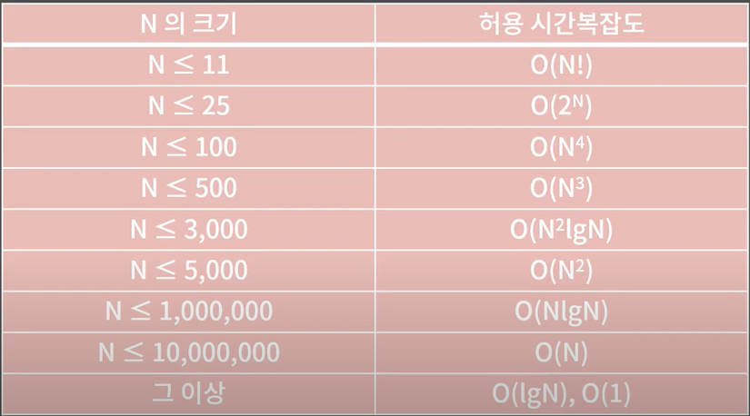

# 시간복잡도, 공간복잡도

# 시간복잡도(time complexity)

컴퓨터는 `1초`에 대략 `3-5억`개 정도의 연산을 처리할 수 있습니다. (대략 1억개의 연산으로 보는 사람도 많습니다.)

그렇다면 시간제한이 1초라 하면, 당신의 프로그램은 3-5억번의 연산 안에 답을 내고 종료해야 한다는 뜻입니다.

## 시간복잡도 계산 방법

```jsx
function func(arr, n) {
  let cnt = 0;
  // let cnt를 선언하는데 연산 1번
  // cnt에 0을 대입하는데 연산 1번
  for (let i = 0; i < n; i++) {
    // n번에 걸쳐 반복되는데 i가 n보다 작은지 체크하는데 연산 1번
    // i에 1을 더해주는 연산 1번
    if (arr[i] % 5 === 0) cnt++;
    // 5로 나눈 나머지 계산할 때 연산 1번
    // 0과 일치하는지 확인할 때 연산 1번
    // 5의 배수면 cnt를 1증가시켜야하니 연산 1번
  }
  return cnt;
  // cnt를 반환할 때 연산 1번
}

const arr = [1, 2, 3, 4, 5];
const result = func(arr, arr.length);
console.log(result);
```

위와 같은 함수 func의 시간복잡도를 계산해봅시다.

**1 + 1 + n \* (2 + 2+ 1) + 1 = `5n + 3`**

n이 100만정도 였으면 대충 500만번의 연산이 필요하니 1초안에 충분히 돌거고, n이 10억이었으면 대충 50억번의 연산이 필요하니 1초안에 다 돌수가 없습니다.

그러나 이렇게 한줄한줄 모두 뜯어볼 필요는 없고 `n에 비례한다` 이정도로만 계산해두면 됩니다.

## 시간복잡도 예시들

** 문제1 **

대회장에 N명의 사람들이 일렬로 서있다. 거기서 당신은 이름이 '가나다'인 사람을 찾기 위해 사람들에게 이름을 물어볼 것이다. 이름을 물어보고 대답을 듣는데까지 1초가 걸린다면 얼마만큼의 시간이 필요할까?

- 정답
  `N`에 비례한다. 앞에서부터 차례대로 물어보면 된다. 최악의 경우 N초, 최선의 경우 1초, 평균적으로 N/2초가 필요하다.

---

** 문제2 **

대회장에 N명의 사람들이 일렬로 서있다. 거기서 당신은 이름이 '가나다'인 사람을 찾기 위해사람들에게 이름을 물어볼 것이다. 이 때 사람들은 이름 순으로 서있다. 이름을 물어보고 대답을 듣는데까지 1초가 걸린다면 얼마만큼의 시간이 필요할까?

- 정답
  `logN`에 비례한다. 업다운 게임을 하듯이 중간 사람에게 계속 물어보면 된다. 최선의 경우 1초, 최악의 경우 logN초, 평균적으로 logN초가 필요하다.

---

**`💡로그`**

코테에는 밑이 2인 로그만 나옵니다. 로그는 해당 수가 2의 몇 거듭제곱인지를 의미합니다. 아래의 로그만 알아도 무방합니다.

```
log2 = 1
log4 = 2
log8 = 3
log16 = 4
log32= 5
```

## 시간복잡도(Time Complexity)

입력의 크기와 문제를 해결하는데 걸리는 시간의 상관관계

### 빅오 표기법(BigO Notation)

주어진 식을 `값이 가장 큰 대표항만` 남겨서 나타내는 방법

O(N) : 5N + 3, 2N+ 10logN, 10N

O(N²) : N² + 2N+4, 6N² + 20N + 10lgN

O(NlgN) : NlgN + 30N + 10, 5NlgN + 6

O(1) : 5, 16, 36


`O(1) < O(lgN) < O(N) < O(NlgN) < O(N²) < O(2ⁿ) < O(N!)`

- O(1) : 상수 시간
- O(lgN) : 로그시간
- O(N) : 선형시간
- O(lgN)~O(N²): N의 거듭제곱끼리의 곱으로 시간복잡도가 나타내어지면 다항시간
- O(2ⁿ) : 지수시간(n이 25이상이면 시간제한을 통과하기 힘들것이다.)
- O(N!) : 1부터 N까지 곱한 값 (N이 11이하정도로 작은게 아니면 시간 제한을 통과하기 어렵다)

문제에서 주어지는 시간 제한은 대부분 1초에서 5초 사이

### n의 크기에 따른 허용 시간복잡도



---

**문제1**

N이하의 자연수 중에서 3의 배수이거나 5의 배수인 수를 모두 합한 값을 반환하는 함수 func1(int N)을 작성하라. N은 10만 이하의 자연수이다.

```jsx
const func = (num) => {
  let arr = Array.from(new Array(num), (x, i) => i + 1);
  // 연산 num 번
  return arr.reduce((acc, el) => {
    if (el % 3 === 0 || el % 5 === 0) {
      return acc + el;
    }
    return acc;
  }, 0);
};

const result = func(34567);
console.log(result);
```

시간복잡도는 O(N)

---

**문제2**

주어진 길이 N의 int배열 arr에서 합이 100인 서로 다른 위치의 두 원소가 존재하면 1을, 존재하지 않으면 0을 반환하는 함수 func2(int arr[], int N)을 작성하라. arr의 각 수는 0이상 100이하이고 N은 1000이하이다.

```jsx
const func = (arr, n) => {
	let result = 0;

  for (let i = 0; i < arr.length; i++) {
    for (let j = i+1; j < arr.length; j++) {
      if(arr[i] + arr[j] === 100) result = 1;
    }
  }
	return result;
};

// const arr = [1, 52, 48];
// const n = 3;
// const arr = [50, 42];
// const n = 2;
const arr = [4, 13, 63, 87];
const n = 4;

const result- func(arr, n);
console.log(result);
```

시간복잡도는 O(N²)

---

**문제3**

N이 제곱수이면 1을 반환하고 제곱수가 아니면 0을 반환하는 함수 func3(int N)을 작성하라. N은 10억 이하의 자연수이다.

```jsx
const func = (n) => {
  let num = 1;
  while (true) {
    if (num * num < n) num += 1;
    if (num * num === n) return 1;
    if (num * num > n) return 0;
  }
};

console.log("\n");
console.log(func(9));
console.log(func(8));
```

시간복잡도는 O(루트(N))

---

**문제4**

N이하의 수 중에서 가장 큰 2의 거듭제곱수를 반환하는 함수 func4(int N)을 작성하라. N은 10억 이하의 자연수이다.

```jsx
const func = (n) => {
  let result = 0;

  for (let i = 1; i ** 2 <= n; i++) {
    result = i ** 2;
  }

  return result;
};

// const result = func(5);
// console.log(result);

const result = func(1024);
console.log(result);
```

시간복잡도 O(lgN)

---

# 공간복잡도(Space Complexity)

입력의 크기와 문제를 해결하는데 필요한 공간의 상관관계

메모리제한이 `512MB = 1.2억개`의 int 선언 가능 (10^6 \* 512 / 4)

### Reference

[https://www.youtube.com/watch?v=9MMKsrvRiw4&list=PLtqbFd2VIQv4O6D6l9HcD732hdrnYb6CY&index=2](https://www.youtube.com/watch?v=9MMKsrvRiw4&list=PLtqbFd2VIQv4O6D6l9HcD732hdrnYb6CY&index=2)
