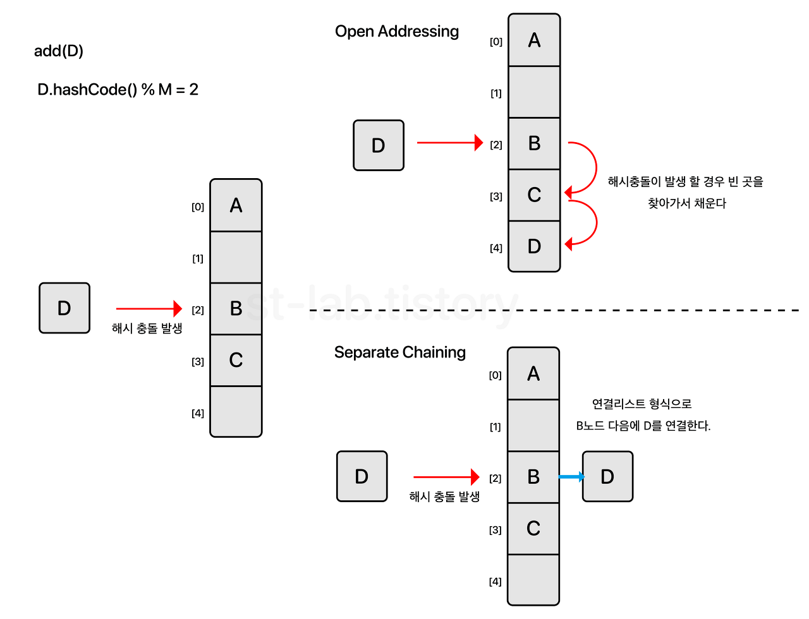
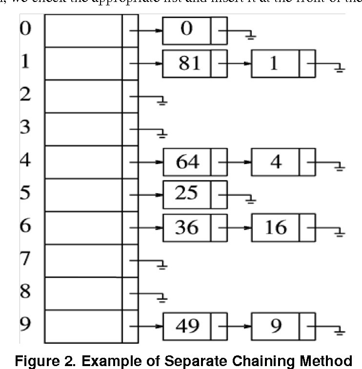

## 해싱(Hashing)

임의의 길이의 값을 해시함수(hash function)을 사용하여 고정된 크기의 값으로 변환하는 작업

### 해시 함수

해시 함수는 임의의 길이를 갖는 메시지를 입력받아서 고정된 길이의 해시값을 출력하는 함수이다. 어떤 입력값에도 항상 고정된 길이의 해시값을 출력한다. SHA(Secure Hash Algorithm)이 예시이다.

## 해시테이블

해시 테이블이란 해시 함수를 사용하여 변환한 값을 index로 삼아 키(key)와 데이터(value)를 저장하는 자료구조를 말한다. 기본연산으로는 탐색, 삽입, 삭제가 있다.

### 해시 테이블 특징

- 순차적으로 데이터를 저장하지 않는다.
- key를 통해서 value를 얻을 수 있다 → 이진 탐색 트리나 배열에 비해서 속도가 획기적으로 빠름
- 데이터를 비교할 때 효율적이다.
- key-value가 1:1 매핑되어 있기 때문에 검색, 삽입, 삭제 과정에서 모두 평균적으로 `O(1)의 시간복잡도`를 갖는다.

### 해시 충돌

할당할 수 있는 slot을 초과하면 두개의 키가 동일한 slot에 해시 될 수 있습니다. 이것을 해시 충돌이라고 한다.

이것을 해결하는 방안으로는 개방 주소법(open addressing)과 분리 연결법(seperate chaining)이 있다.

## 개방 주소법(Open Addressing)

해시 함수로 얻은 주소가 아닌, 다른 주소에 데이터를 저장할 수 있도록 허용하는 방법

### 선형 탐사법(Linear Probing)

선형으로 순차적 검색을 하는 방법이다.

### 제곱 탐사법(Quadratic Probing)

선형 탐사법과 동일한데, 고정폭이 아니라 제곱으로 늘어난다.

## 분리연결법(Seperate chaining)

한 슬롯(버킷) 당 들어갈 수 있는 엔트리의 수에 제한을 두지 않는다. 이때 버킷에는 `linked list나 tree`를 사용한다.

### reference

[https://velog.io/@edie_ko/hashtable-with-js](https://velog.io/@edie_ko/hashtable-with-js)
