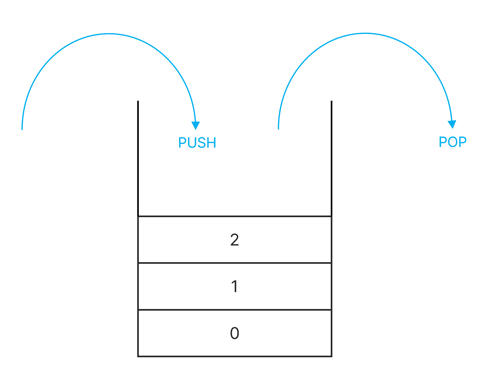
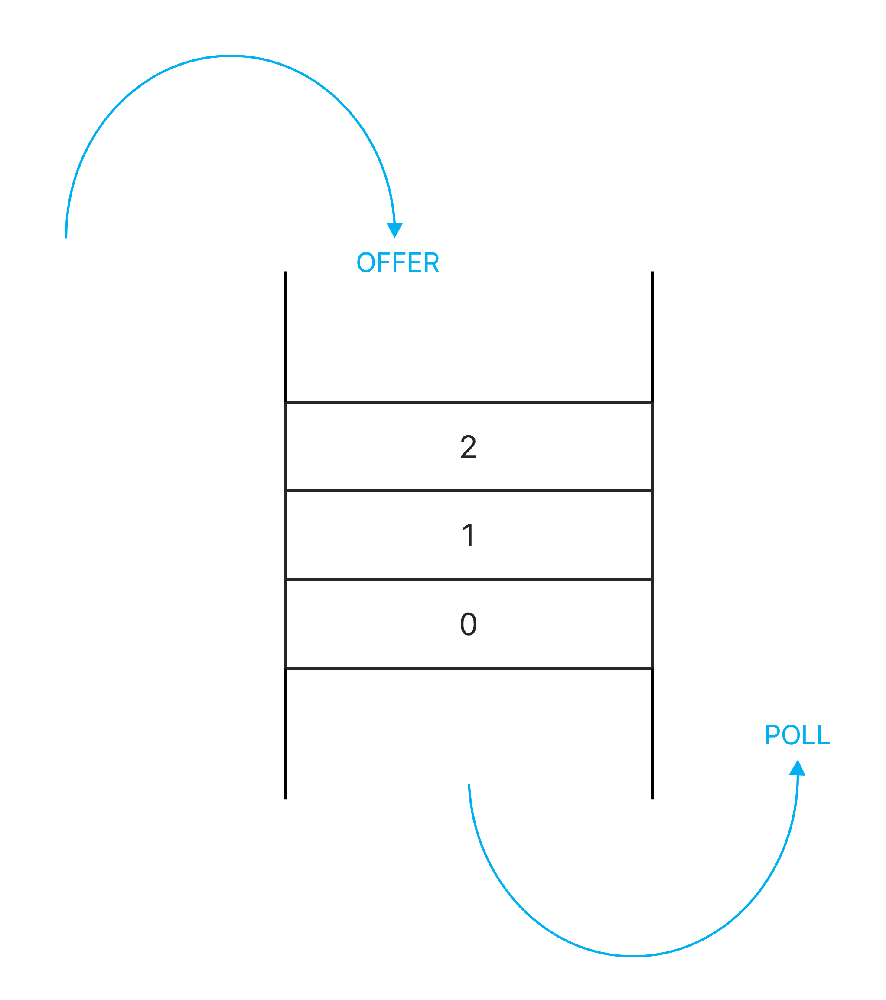

## Stack

쌓아 올린 형태의 자료구조

### 스택의 특징

- 가장 마지막에 삽입된 자료가 가장 먼저 삭제된다.
- 삽입과 삭제가 한 방향에서만 이루어진다.
- 후입선출(LIFO, Last In First Out) 구조
- top으로 정한 곳을 통해서만 접근이 가능하다.
- 삽입하는 연산은 push, 삭제하는 연산은 pop이라고 한다.

### 스택 활용 예시

- 웹 브라우저 방문기록 (뒤로가기): 가장 나중에 열린 페이지부터 다시 보여준다.
- 실행 취소
- 역순 문자열 만들기

## Queue

### 큐의 특징

- 삽입 작업이, 다른 쪽 끝에서 삭제 작업이 양쪽으로 이루어진다.
- 선입 선출 (First In, First Out)
- 삭제 연산만 수행되는 곳은 front, 삽입 연산만 이루어지는 곳을 rear라고 한다.
- 삽입 연산을 인큐(enQueue)라고 하고 삭제 연산을 디큐(deQueue)라고 한다.

### 큐 활용 예시

- 우선순위가 같은 작업 예약(프린터의 인쇄 대기열)
- 은행 업무
- 프로세스 관리
- 너비 우선 탐색(BFS, Breadth-First Search) 구현
- 캐시(Cache) 구현

### 우선순위 큐 (Priority Queue)

우선순위 큐는 들어간 순서에 상관없이 우선순위가 높은 데이터가 먼저 나오는 것을 말한다.
보통 우선순위 큐는 힙(Heap)이라는 자료구조로 구현을 한다.

힙이란 루트노드가 가장 큰 값을 갖는 완전 이진트리 형식의 자료구조 이다.
