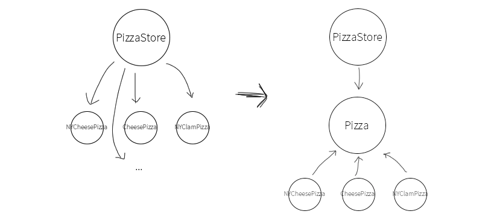

# 팩토리 패턴(Factory pattern)

- 객체를 만드는 과정에 중요성을 둔 느슨한 결합
- 불필요한 의존성 없앨 수 있음

# 팩토리 패턴이 필요한 이유

### 구상(concrete)?

- 추상(abstract)와 대조적인 단어
- 구상 클래스(concrete class)란 new 키워드로 객체를 생성할 수 있는 클래스
- 구상 객체란 new 키워드로 만든 객체, 인스턴스

구상 클래스들이 많다는 건 아래와 같이 코드가 짜여있다는 말이다

```jsx
Pizza pizza;

if(cheese) {
	pizza = new CheesePizza();
} else if (greek) {
	pizza = new GreekPizza();
} else if (pepperoni) {
	pizza = new PepperoniPizza();
}

```

이 코드를 보면 변경하거나 확장해야 할 때 코드를 다시 확인하고 추가하고 제거해야한다는 걸 뜻한다. 즉, 이런식으로 코드를 만들면 갱신하기가 어려워지고 오류가 생길 가능성이 높다.

문제는 변화(mutation)이다. 인터페이스에 맞춰서 코딩을 하면 시스템에서 일어날 수 있는 여러 변화를 이겨낼 수 있다. 반대로 구상 클래스를 많이 사용하면 새로운 구상 클래스가 추가될 때마다 코드를 고쳐야 하기 때문에 문제가 생길 수 있다.

# 팩토리 패턴 만드는법

### 바뀌는 부분과 바뀌지 않는 부분 찾아내기

```jsx
function orderPizza(type) {
  let pizza;

  // ❗️바뀔 수 있는 부분
  if (type === "cheese") {
    pizza = new CheesePizza();
  } else if (type === "greek") {
    pizza = new GreekPizza();
  } else if (type === "pepperoni") {
    pizza = new PepperoniPizza();
  }

  // ❗️바뀌지 않는 부분
  pizza.prepare();
  pizza.bake();
  pizza.cut();
  pizza.box();

  return pizza;
}

// Example usage:
const pizza = orderPizza("cheese");
```

바뀔 수 있는 부분은 인스턴스를 만들 구상 클래스를 선택하는 부분이다. 즉, `객체 생성 부분을 캡슐화해야한다.` 이 부분을 팩토리라는 클래스로 캡슐화 할 할것이다.

```jsx
class SimplePizzaFactory {
  createPizza(type) {
    let pizza = null;

    if (type === "cheese") {
      pizza = new CheesePizza();
    } else if (type === "greek") {
      pizza = new GreekPizza();
    } else if (type === "pepperoni") {
      pizza = new PepperoniPizza();
    }

    return pizza;
  }
}
```

이렇게 하면 클라이언트 코드 내에서 구상 클래스의 인스턴스를 만드는 코드를 전부 없앨 수 있다. 아래는 코드 전문이다.

---

# Simple factory

```jsx
class Pizza {
  prepare() {
    console.log(`Preparing ${this.constructor.name}`);
  }

  bake() {
    console.log("Baking " + this.constructor.name);
  }

  cut() {
    console.log("Cutting " + this.constructor.name);
  }

  box() {
    console.log("Boxing " + this.constructor.name);
  }
}

class CheesePizza extends Pizza {}
class GreekPizza extends Pizza {}
class PepperoniPizza extends Pizza {}

// 팩토리를 만들어서 클라이언트에 대한 인스턴스 생성 캡슐화
class SimplePizzaFactory {
  createPizza(type) {
    let pizza = null;

    if (type === "cheese") {
      pizza = new CheesePizza();
    } else if (type === "greek") {
      pizza = new GreekPizza();
    } else if (type === "pepperoni") {
      pizza = new PepperoniPizza();
    }

    return pizza;
  }
}

class PizzaStore {
  constructor(factory) {
    this.factory = factory;
  }

  orderPizza(type) {
    const pizza = this.factory.createPizza(type);
    pizza.prepare();
    pizza.bake();
    pizza.cut();
    pizza.box();

    return pizza;
  }
}

// 사용 :
const factory = new SimplePizzaFactory();
const store = new PizzaStore(factory);

const cheesePizza = store.orderPizza("cheese");
const pepperoniPizza = store.orderPizza("pepperoni");
const veggiePizza = store.orderPizza("veggie");
```

SimplePizzaFactory 클린한 함수로 구현

```jsx
function simplePizzaFactory(type) {
  const PIZZA_TYPE = {
    cheese: new CheesePizza(),
    greek: new GreekPizza(),
    pepperoni: new PepperoniPizza(),
  };
  return PIZZA_TYPE[type];
}
```

---

# Factory method pattern

객체를 생성하기 위한 인터페이스를 정의하는데 **어떤 클래스의 인스턴스를 만들지는 서브 클래스에서 결정하게 만드는 것**

```jsx
class Pizza {
  constructor() {
    this.name = "";
    this.dough = "";
    this.sauce = "";
    this.toppings = [];
  }

  // 피자 준비 과정에서 몇 가지 정해진 단계를 따라야 한다.
  prepare() {
    console.log(`Prepare ${this.name}`);
    console.log("Tossing dough...");
    console.log("Adding sauce...");
    console.log("Adding toppings: ");
    this.toppings.forEach((topping) => {
      console.log(`   ${topping}`);
    });
  }

  // 추상 클래스에서 피자를 굽고, 자르고, 상자에 담는 일에 몇 가지 기본 값을 제공한다.
  bake() {
    console.log("Bake for 25 minutes at 350");
  }

  cut() {
    console.log("Cut the pizza into diagonal slices");
  }

  box() {
    console.log("Place pizza in official PizzaStore box");
  }

  getName() {
    return this.name;
  }
}

// 서브클래스
class CheesePizza extends Pizza {
  constructor() {
    super();
    this.name = "Cheese Pizza";
    this.dough = "Regular Crust";
    this.sauce = "Marinara Pizza Sauce";
    this.toppings = ["Fresh Mozzarella", "Parmesan"];
  }
}

class GreekPizza extends Pizza {
  constructor() {
    super();
    this.name = "Greek Pizza";
    this.dough = "Thin Crust";
    this.sauce = "Garlic Sauce";
    this.toppings = ["Olives", "Feta Cheese", "Spinach"];
  }
}

class PepperoniPizza extends Pizza {
  constructor() {
    super();
    this.name = "Pepperoni Pizza";
    this.dough = "Crust";
    this.sauce = "Marinara sauce";
    this.toppings = ["Sliced Pepperoni", "Sliced Onion", "Grated parmesan cheese"];
  }
}

const pizza = new CheesePizza();
pizza.prepare();
pizza.bake();
pizza.cut();
pizza.box();
```

- 생산자(creator) 클래스 : GreekPizza, PepperoniPizza, CheesePizza
- 제품(product) 클래스 : Pizza

### 다른 예

```jsx
// 인터뷰 보는 사람들의 인터페이스
class Developer {
  askQuestions() {
    console.log("Asking about design patterns!");
  }
}

class CommunityExecutive {
  askQuestions() {
    console.log("Asking about community building");
  }
}

// 인사담당자의 클래스
class HiringManager {
  takeInterview() {
    const interviewer = this.makeInterviewer();
    interviewer.askQuestions();
  }
}

// 필요한 면접관을 제공 (서브클래스)
class DevelopmentManager extends HiringManager {
  makeInterviewer() {
    return new Developer();
  }
}

class MarketingManager extends HiringManager {
  makeInterviewer() {
    return new CommunityExecutive();
  }
}

// 사용
const devManager = new DevelopmentManager();
devManager.takeInterview(); // Output: Asking about design patterns

const marketingManager = new MarketingManager();
marketingManager.takeInterview(); // Output: Asking about community building.
```

클라이언트가 필요한 하위 클래스를 모르는 경우 사용

---

추상 팩토리 패턴을 설명하기 앞서 의존성 뒤집기 원칙에 대해 알아보자.

# 의존성 뒤집기 원칙(Dependency Inversion Principle)

- 추상화된 것에 의존하게 만들기
- 고수준 구성요소(인터페이스)가 저수준 구성요소(구현체)에 의존하면 안됨
  

# 추상 팩토리 패턴 (Abstract Factory)

- 구체적인 클래스를 지정하지 않고 개발적이지만 관련있는 팩토리를 함께 그룹화 하는 펙토리
- 구체적인 클래스를 지정하지 않고 공통 주제를 가진 개별 팩토리 그룹을 캡슐화 하는 방법

```jsx
// Pizza 인터페이스
class PizzaIngredientFactory {
  createDough() {
    throw new Error("This method must be overridden!");
  }

  createSauce() {
    throw new Error("This method must be overridden!");
  }

  createCheese() {
    throw new Error("This method must be overridden!");
  }

  createVeggies() {
    throw new Error("This method must be overridden!");
  }

  createPepperoni() {
    throw new Error("This method must be overridden!");
  }

  createClams() {
    throw new Error("This method must be overridden!");
  }
}

// 뉴욕 피자 팩토리 클래스
class NYPizzaIngredientFactory extends PizzaIngredientFactory {
  createDough() {
    return new ThinCrustDough();
  }

  createSauce() {
    return new MarinaraSauce();
  }

  createCheese() {
    return new ReggianoCheese();
  }

  createVeggies() {
    return [new Garlic(), new Onion(), new Mushroom(), new RedPepper()];
  }

  createPepperoni() {
    return new SlicedPepperoni();
  }

  createClams() {
    return new FreshClams();
  }
}

// 시카고 피자 팩토리 클래스
class ChicagoPizzaIngredientFactory extends PizzaIngredientFactory {
  createDough() {
    return new ThickCrustDough();
  }

  createSauce() {
    return new PlumTomatoSauce();
  }

  createCheese() {
    return new MozzarellaCheese();
  }

  createVeggies() {
    return [new BlackOlives(), new Spinach(), new EggPlant()];
  }

  createPepperoni() {
    return new SlicedPepperoni();
  }

  createClams() {
    return new FrozenClams();
  }
}

// 피자 클래스
class Pizza {
  constructor() {
    this.name = "";
    this.dough = null;
    this.sauce = null;
    this.veggies = [];
    this.cheese = null;
    this.pepperoni = null;
    this.clams = null;
  }

  prepare() {
    throw new Error("This method must be overridden!");
  }

  bake() {
    console.log("Bake for 25 minutes at 350");
  }

  cut() {
    console.log("Cutting the pizza into diagonal slices");
  }

  box() {
    console.log("Place pizza in official PizzaStore box");
  }

  getName() {
    return this.name;
  }
}

// CheessePizza
class CheesePizza extends Pizza {
  constructor(ingredientFactory) {
    super();
    this.ingredientFactory = ingredientFactory;
    this.name = "Cheese Pizza";
  }

  prepare() {
    console.log("Preparing " + this.name);
    this.dough = this.ingredientFactory.createDough();
    this.sauce = this.ingredientFactory.createSauce();
    this.cheese = this.ingredientFactory.createCheese();
  }
}

// 피자 재료 클래스들 (예시)
class ThinCrustDough {}
class MarinaraSauce {}
class ReggianoCheese {}
class Garlic {}
class Onion {}
class Mushroom {}
class RedPepper {}
class SlicedPepperoni {}
class FreshClams {}

class ThickCrustDough {}
class PlumTomatoSauce {}
class MozzarellaCheese {}
class BlackOlives {}
class Spinach {}
class EggPlant {}
class FrozenClams {}

// 사용
const nyFactory = new NYPizzaIngredientFactory();
const chicagoFactory = new ChicagoPizzaIngredientFactory();

const nyCheesePizza = new CheesePizza(nyFactory);
nyCheesePizza.prepare();
nyCheesePizza.bake();
nyCheesePizza.cut();
nyCheesePizza.box();
console.log("Ordered a " + nyCheesePizza.getName());

const chicagoCheesePizza = new CheesePizza(chicagoFactory);
chicagoCheesePizza.prepare();
chicagoCheesePizza.bake();
chicagoCheesePizza.cut();
chicagoCheesePizza.box();
console.log("Ordered a " + chicagoCheesePizza.getName());
```

---

# 프론트앤드에서의 팩토리패턴

React에선 이미 컴포넌트를 구성할 때 팩토리 패턴을 사용하고 있었다.

```jsx
import React, { createFactory } from "react";

const MyComponent = ({ name }) => {
  return <div>Hello, {name}!</div>;
};

const MyFactory = createFactory(MyComponent);

export default function App() {
  return <MyFactory name="John Doe" />;
}
```

```jsx
const CarFactoryComponent = (carModel, brandName, color) => {
  <div brandName={brandName} carModel={carModel} color={color} />;
};

const ToyotaCamry = () => {
  <CarFactoryComponent brandName="toyota" carModel="camry" color="black" />;
};

const FordFiesta = () => {
  <CarFactoryComponent brandName="ford" carModel="fiesta" color="blue" />;
};
```

```jsx
function renderSimpleUser() {
  // ...
  return <User {...userProps}>
}

function renderComplexUser() {
  // ...
  return <User {...userProps}>
}

const userComponent1 = renderSimpleUser(api.getSimpleUser());
const userComponent2 = renderComplexUser(api.getComplexUser());
```
