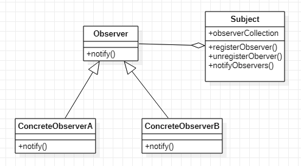

# 옵저버 패턴 (Observer Pattern)



## 옵저버 패턴의 흐름 = 신문 구독 메커니즘 or job seeker 메커니즘

1. 신문사가 사업을 시작하고 신문을 찍어낸다.
2. 독자가 신문사에게 구독신청을 하면 매번 새로운 신문이 나올 때마다 신문을 배달받는다. 계속 구독자로 남아있는 한 신문을 받을 수 있다.
3. 신문을 더이상 보고싶지 않으면 구독 해지 신청을 한다. 그러면 더이상 신문은 오지 않는다.
4. 신문사가 계속 영업을 하는 이상 여러 개인 독자, 회사, 호텔에서 꾸준히 구독 및 해지를 하게 된다.

# 옵저버 패턴 특징


- 한 객체의 상태가 바뀌면 그 객체에 의존하는 다른 객체들한테 연락이 가고 자동으로 내용이 갱신되는 방식으로 (one to many) 의존성을 정의
- Observer 객체들한테 연락을 돌리는 순서에 의존하도록 코드를 만들었다면 그 방법이 잘못된것이다. (왜냐면 순서에 의존하는 순간, 느슨한 결합이 아니다)
- 여러 GUI 프레임워크에서 옵저버 패턴이 많이 쓰인다.

### subject 객체

- 주제의 데이터가 달라지면 옵저버한테 그 소식이 전해집니다.
- 일부 데이터를 관리합니다.
- 데이터가 바뀌면 새로운 데이터 값이 어떤 방법으로든 옵저버들에게 전달됩니다.

### publisher 객체(observer)

- subject를 구독하고 있으며 (주제 객체에 등록되어 있으며) subject의 데이터가 바뀌면 갱신 내용을 전달받는다.

<br />
<br />

# code (JS)

## 간단한 예제

```jsx
class Subject {
  constructor() {
    this.observers = [];
  }

  // 옵저버 등록(구독)
  subscribe(observer) {
    this.observers.push(observer);
  }

  // 옵저버 제거(구독취소)
  unsubscribe(observer) {
    this.observers.splice(this.observers.indexOf(observer), 1);
  }

  // 변경을 알려주는 함수
  notifyAll(data) {
    this.observers.forEach((observer) => observer(data));
  }
}

const subject = new Subject();

const observer1 = (data) => console.log("first " + data);
const observer2 = (data) => console.log("second " + data);

subject.subscribe(observer1); // 구독
subject.subscribe(observer2); // 구독
subject.notifyAll("abc1");

subject.unsubscribe(observer2); // 구독 취소
subject.notifyAll("abc2");
```

### job seeker 구현 예제

직업 공고가 필요한 구직자 클래스(JobSeeker)를 만든다.

```jsx
const JobPost = (title) => ({
  title: title,
});

class JobSeeker {
  constructor(name) {
    this._name = name;
  }

  notify(jobPost) {
    console.log(this._name, "has been notified of a new posting :", jobPost.title);
  }
}
```

구독할 구인구직 게시물들의 정보를 주는 Class를 만든다. 이 클래스를 구독하면 구인구직 게시물을 구독할 수 있고, 구인 게시물또한 등록할 수 있다.

```jsx
class JobBoard {
  constructor() {
    this._subscribers = [];
  }

  subscribe(jobSeeker) {
    this._subscribers.push(jobSeeker);
  }

  addJob(jobPosting) {
    this._subscribers.forEach((subscriber) => {
      subscriber.notify(jobPosting);
    });
  }
}
```

아래처럼 사용할 수 있다.

```jsx
// Create subscribers
const jonDoe = new JobSeeker("John Doe");
const janeDoe = new JobSeeker("Jane Doe");
const kaneDoe = new JobSeeker("Kane Doe");

// Create publisher and attach subscribers
const jobBoard = new JobBoard();
jobBoard.subscribe(jonDoe);
jobBoard.subscribe(janeDoe);

// Add a new job and see if subscribers get notified
jobBoard.addJob(JobPost("Software Engineer"));

// Output
// John Doe has been notified of a new posting : Software Engineer
// Jane Doe has been notified of a new posting : Software Engineer
```

<br />
<br />

# 느슨한 결합(loose coupling) vs 강한 결합(tight Coupling)

### 느슨한 결합(loose coupling)

- 느슨하게 결합되어 있다는 것은 상호작용을 하긴 하지만 서로에 대해서 잘 모른다는 것을 의미
- 옵저버 패턴 → 느슨한 결합
  - subject가 옵저버에 대해 아는 것은 옵저버가 특정 인터페이스를 구현한다는 것 뿐이다. 옵저버가 뭘 하는지 알 필요가 없다.
  - 옵저버를 언제든지 새로 추가할 수 있다
  - 옵저버를 추가해도 subject를 변경할 필요가 없다
  - 옵저버와 subject는 서로 독립적으로 재사용할 수 있다.
  - subject나 옵저버가 바뀌더라도 서로한테 영향을 미치지는 않는다

### 강한 결합(tight Coupling)

- 서로 다른 클래스들이 서로 크게 의존하는 경우를 의미

## 코드 예시(JS)

결과를 CSV로 반환해달라는 요청사항이 JSON형식으로도 반환해달라고 할때

**강한 결합(tight coupling)**

```jsx
class Output {
  print() {
    throw new Error("This method should be overridden!");
  }
}

// CSVOutput class
class CSVOutput extends Output {
  print() {
    console.log("CSV Output");
  }
}

// JSONOutput class
class JSONOutput extends Output {
  print() {
    console.log("JSON Output");
  }
}

// Class1 equivalent
class Class1 {
  outputPrint() {
    // 결과값은 CSV로 hard coding 되어있다.
    // 이 메소드는 CSVOutputGenerator class와 강한 결합(tightly coupled)이 되어있다. 만약 output을 바꾸려면 이 메소드를 바꿔야 한다.
    // 어떤 메소드라도 Class1의 generateOutput메소드는 CSVOutput을 리턴한다. (CSVOutputGenerator 메소드와 강하게 결합되어있다.)
    const output = new CSVOutput();
    output.print();
  }
}

// Example usage
const class1Instance = new Class1();
class1Instance.outputPrint(); // Outputs: CSV Output
```

**느슨한 결합(loose coupled)**

```jsx
class Output {
  print() {
    throw new Error("This method should be overridden!");
  }
}

// CSVOutput class
class CSVOutput extends Output {
  print() {
    console.log("CSV Output");
  }
}

// JSONOutput class
class JSONOutput extends Output {
  print() {
    console.log("JSON Output");
  }
}

class Class1 {
  outputPrint(output) {
    // JSON으로 작성하면, JSONOutput 메소드를 전달하면 된다. (의존성은 외부에서 이뤄진다.)
    // CSV으로 작성하면, CSVOutput 메소드를 전달하면 된다. (의존성은 외부에서 이뤄진다.)
    // 느슨한 결합(loose coupling)덕에, Class1의 코드를 바꿀 필요가 없다. 왜냐하면 Class1은 CSVOutput JSONOutput 클래스와 느슨하게 결합되어있기 때문이다.
    // 어떤 메서드도 output으로 추가할 수 있다. Class1은 CSVOutput or JSONOutput class와 강하게 결합(tight couple)되어 있지 않기 대문이다.
    output.print();
  }
}

// usage
const csvOutput = new CSVOutput();
const jsonOutput = new JSONOutput();
const class1Instance = new Class1();

class1Instance.outputPrint(csvOutput); // Outputs: CSV Output
class1Instance.outputPrint(jsonOutput); // Outputs: JSON Output
```

강한 결합의 의미는 어떤 것을 추가하거나 삭제 할때 관련없는 것들은 수정하지 말아야 한다. 위 예제에서는 어떠한 것을 추가할때 Class1 내부를 수정하지 않아야 한다는 것. 그 의존성은 `외부`에서 일어나야 한다.

이 느슨한 결합을 자세히 보면, pub-sub 패턴과 observer 패턴과 비슷하다.

### pub-sub pattern vs observer pattern

- observer패턴은 observer와 subject가 서로를 인지하지만 pub-sub 패턴의 경우 서로를 전혀 몰라도 상관없다. 그래서 pub-sub의 결합도가 더 낮다
- pub-sub은 캐싱할때 사용
- observer pattern은 이벤트 리스너 관련
- observer는 동기, pub-sub은 비동기

# 사용 시기

- 앱이 한정된 시간, 특정한 케이스에만 다른 객체를 관찰해야 하는 경우
- 대상 객체의 상태가 변경될 때마다 다른 객체의 동작을 트리거 해야 할 때
- 한 객체의 상태가 변경되면 다른 객체도 변경해야 할때, 그런데 어떤 객체들이 변경되는지 몰라도 될때
- MVC패턴에서 사용됨 - Model과 View관계는 Observer패턴의 Subject역할과 Observer역할과 대응된다.
- 하나의 Model에 복수의 View가 대응된다.

## 프론트엔드에서의 옵저버 패턴

- 상태 관리, 이벤트 처리, 데이터 바인딩 등 유용하게 쓰인다.
- React, Vue에서도 기본적으로 이 패턴을 활용하고 있다.
- MVC
