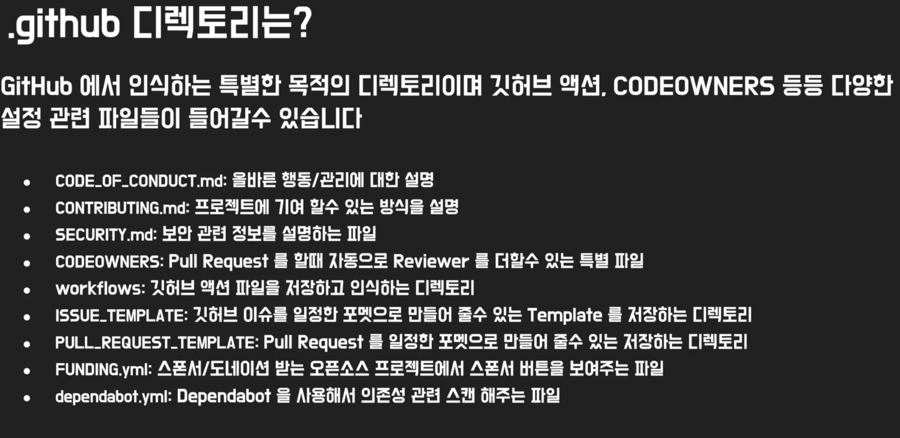
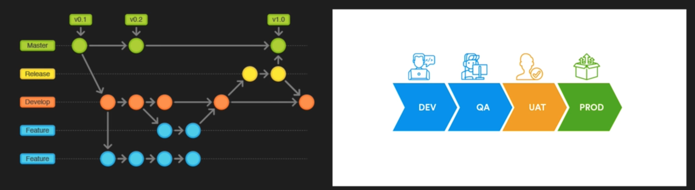
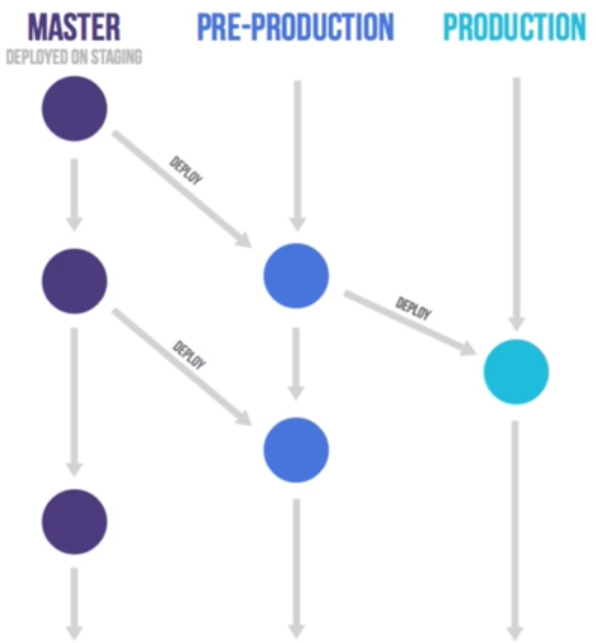
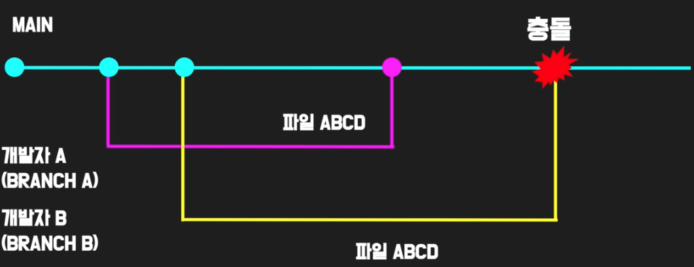
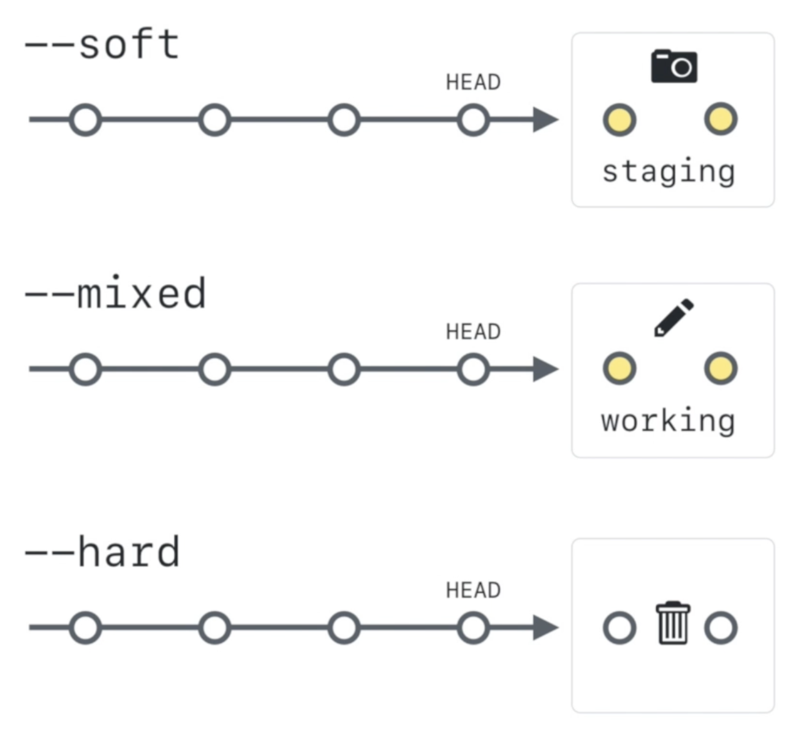

# Advance git

2024.05.23

[깃허브 솔루션 아키텍트에게 직접 배워보는 깃 (Git) 그리고 깃허브 (GitHub) 완전 코스](https://www.udemy.com/course/git-course-korea/)를 수강 후 정리한 내용

<br />

---

깃 레포 이름은 `소문자`로 만드는 걸 추천

pull request의 시작은 완벽하지 않아도 된다. 계속 이야기 하면서 협업하기 위한 과정이다.

대부분의 기업은 fork 하는 것 보다 branch를 만들어서 pull request하는 것을 선호한다.

remote에 있는 git 브랜치를 로컬로 가져올때 `git checkout <remote에 있는 브랜치 명>` 하면 가져올 수 있다. (origin/main/브랜치명 다 적을 필요 없음)

git checkout -b new-branch 로 새로운 브랜치 만들기 + 이동까지 할 수 있다.

git branch -d <브랜치이름> 했을때 로컬에 있는 브랜치만 지워지고 리모트에 있는 브랜치는 지워지지 않는다.

git restore —staged README.md → add로 스테이징 한 파일 되돌리기

git commit -am "메세지" add와 Commit 동시에 하기

git log —all —graph 시각화해서 예쁘게 로그 보기

커밋(commit)은 자주하면 할수록 좋다

.github의 파일들


### github page

- github page는 static 웹 페이지만 배포가능하기 때문에 react와 같은 framework은 사용할 수 없다. 하고싶으면 github action이나 github pakage를 이용하여 web application으로 사용하는게 더 맞다.
- DB에 접근해도 되는지의 여부는 js를 사용하면 가능하지만 보안처리를 할 수 없기 때문에 추천하는 방식은 아니다.

### git pull vs git fetch

git pull

- **리모트 저장소의 변경된 파일을 모두 가지고오는 명령어**
- 현재 작업하고 있는 branch 뿐만 아니라 다른 branch도 가져온다.

git fetch

- **리모트 환경에서 어떤 변화가 있는지만 확인**
- 언제? 원격 레포와 로컬 레포의 변경 사항이 다를 때, 이를 비교 및 대조하는 확인 작업이 필요할때 사용
- 원격 저장소의 변경 사항만 로컬 저장소로 가져온다. 로컬 복사본과 병합하지 않는다. 즉 변경 내용만 다운로드 한다.

예시 상황

빈 repo에 index.html 파일을 더했다. 로컬에는 반영이 되지 않은 상태. 이 상황에서 git pull을 한다면 index.html이 내 로컬에 반영이 된다.
→ git fetch를 한다면 내 woking directory로 반영이 되지 않는다. 대신 둘의 차이점 즉, 변경사항을 확인 할 수 있다. 확인 후에 git merge를 해줘야한다.

```bash
git fetch
git log —all # 변경사항을 볼 수 있음. 그러나 local 코드에 반영되지 않음
git diff main remotes/origin/main # 현재 코드와의 변경 사항을 볼 수 있음
# 변경사항을 고치고 commit
```

### 모노레포(monorepo)?

- 여러가지 프로젝트를 하나의 리포지터리로 관리
- 장점보단 단점이 더 많고, repo가 커지면 커질수록 문제가 더 많이 생길 수 있다.

### 브랜치

- 업무를 완성하면 지우고 새로 만드는 방식 선호
- agile같은 프로젝트 메니지먼트 방식에서 태스크와 연결되어 사용 가능
- 브랜치는 복잡해지면 복잡해질수록 커밋 복구가 어려우니 단기적인 브랜치를 만드는게 효율적 (만약 만들어야 한다면 깃허브 레포에서 공동으로 쓰일 새로운 브랜치를 먼저 만드는 방법 추천)
  
- Develop에서 테스팅하고 Realase브랜치에서 안전하게 배포된 후 main/master로 merge
- 디폴트 브랜치 (main/master)
  - branch protection으로 안전하게 보호하고 직접적인 merge는 가능하지 않도록 설정
- feature-xxx 브랜치 : 새로운 기능을 추가할 때 사용. main/master에 직접 merge는 불가능하도록 설정
- hotfix-xxx 브랜치 : production환경에서 중요한 에러나 버그를 고치기 위한 브랜치. 직접 main/master에 merge가능하게 설정

<br />

브랜치 모델

- github flow
  - main 브렌치와 feature 브랜치만 존재함
  - 장점 : 간단한 워크플로우
  - 단점 : 버그나 문제가 자주 일어날 수 있음, 큰 팀에 적합하지 않음
- gitlab flow

  - github flow와 비슷하지만 배포를 위한 production 브랜치가 따로 있음
  - 장점 : 깃허브 플로우의 단점을 보완하지만 간단한 플로우
  - 단점 : 실제 클라우드 모델에 쓰기엔 단점이 있음
    

- Trunk-based flow
  - 정해진 지속되는 브랜치가 있고 같은 main 브랜치에 merge
  - 장점 : 브랜치 메니지먼트가 필요없고 지속적인 브랜치 사용 가능
  - 단점 : 깃의 기본적인 브랜치 개념을 따르지 않음
- `gitflow`

  - 기업에서 가장 많이 쓰는 브랜치 모델. main 브랜치에서 변화는 hotfix 브랜치만 가능하고, feature 브랜치는 development 브랜치로 merge
  - 잠점 : 가장 기업 변화에 유연한 모델
  - 단점 : 복잡함

### git switch vs git checkout

- git switch은 사전적 의미를 더 명확하게 하기 위해서 추가. 아직은 실험 단계.

### pull request

1. write 권한이 있을 경우 - 브랜치를 통해서 pull request
2. write 권한이 없을 경우 - fork한 후 다른 리포에서 PR(오픈소스 방식)

### 브랜치 보호

- 아무나 풀리퀘 해서 merge하면 곤란하니까 막는다.
- settings - Branches - Add branch protection rules
- 몇 명이 승인해야 merge가 가능한지 등등 여러가지 지정 가능
- Require approvals는 주로 `1명`이 승인하게끔 하는것이 좋다

### 자동 검토 요청 - CODEOWNERS

.github/CODEOWNERS 만들기

```bash
# 자동 리뷰어 더하기

* @datoybi @datoybi2
```

### 병합 충돌 (Merge Conflict)



충돌이 일어날 수 있는 경우

1. 패키지나 서비스의 의존성

   → github action 같은 데브옵스 서비스를 만들어서 성공 / 실패를 체크 한 후 Pull Request Merge조건으로 하기

2. **한 파일을 여러 사람이 작업하고 있을 때**

   - github page pull request에서 특수 기호들 제거하고 충돌 해결하기

- loca에서 충돌났을 때
  ```bash
  git pull
  # hint: You have divergent branches and need to specify how to reconcile them..
  # hint shown
  git config pull.rebase false
  git pull
  # 이러고 나서 충돌 해결하기
  # 그러고 나서 git add . 후 commit
  ```
  흔치않다. 왜냐면 main은 바뀌지 않으니까

### git stash

작업을 하고 있을때 현재 일하고 있는 아직 커밋이 안된 파일들의 상태를 stack에 저장할 수 있는 기능

git stash 유용할 때

- 리모트 저장소의 업데이트를 받기 윈하는데 아직 커밋할 준비는 안되었을때
- 현재 작업을 한 브랜치에서 하다가 다른 브랜치로 바꾸어야 할때
- 사용법
  1.  git stash를 사용하여 git pull하기전에 임시 저장
  2.  git pull을 사용해서 새로운 업데이트를 받음
  3.  git stash pop을 사용해서 원래 작업했던 파일을 돌려 놓음

```bash
# git stash 사용법
git pull
# error 발생
error: Your local changes to the following files would be overwritten by merge:
Please commit yout changes or stash them before you merge.

get stash list # stash list가 있나 확인
git stash -m "Stash해서 저장하기" # stash에 현재 상태 저장
git pull
# 충돌난 파일 확인

git stash pop # stash에 저장한 상태 가져오기
# 충돌난거 처리 및 저장

git stash clear # stash list 없애기
```

### git Tag

- Lightweight tag : 기본 태그로 만든 후 바꿀 순 있지만 메시지를 달 수 없다
  git tag <태그 이름>
- `Annotated tag` : 한번 만들면 바꿀 수 없는 태그, 추가적으로 메시지를 더할 수 있는 태그. 가능한 이 태그를 사용하길 추천
  git tag -a <태그 이름> -m “<메세지>”

### github release

- git tag에 추가 기능을 더하는 기능으로 Release Note나 더 자세한 메시지 그리고 파일을 추가할 수 있다.
- 패키지로 공유할 때 매우 유용하다.

### LFS(Large File System)

- 큰 파일들을 깃에서 저장하는 방식
- 깃 리포지터리는 모든 파일의 저장소가 아니다. (exe, jpg, png, xslx, pdf, mp4…)
- 깃 LFS는 오디오 파일, 큰 이미지 파일, 비디오 파일 등등 git 리포에 필요하지만 사이즈가 큰 파일을 저장하기 위한 곳

### git size 측정 툴

- git-sizer
- git filter repo
- gh-repo-state

### purge

- 파일 지우기
- 위험한 과정
- 깃 히스토리를 바꾸고 shell 명령어가 들어가기 때문에 충분한 필요성과 자신이 있지 않으면 추천하지 않음 (오히려 LFS 제한을 늘리더라도 모든 파일들을 LFS에 옮기는게 더 쉽고 안전)

### 커밋 되돌리기

- git revert
  - 새로운 커밋을 만들어서 파일을 돌려놓는 방법
  - 가장 안전한 방법
  - 기록을 깔끔하게 유지하기 원할땐 맞지않음
  - 커밋1이 있고 커밋2가 있는데 커밋1로 revert하려고 하면 커밋 1의 내용만 복구되고 **커밋2의 내용은 복구가 되지 않는다.**
- git amend
  - git commit에 amend라는 argument 추가
  - 이 전 커밋에 추가적인 내용이나 메시지를 다시 넣어 커밋을 고치는 방법
  - 바로 전에 만들었던 커밋을 바로 고치기에 편함
- Git Cherry Pick
  - 실수로 다른 브랜치에 커밋
  - 한 브랜치에서 개발한 커밋을 다른 커밋으로 가져올 때
- git reset
  - 위험하다. 특히나 hard reset은 필요할 때만 사용해야 한다.
    
  - 모든걸 되돌려 놓는다는 의미
  - 종류 : soft, mixed(default), hard

### .git 디렉토리

- DVCS(분산 버전 관리 시스템)이기 때문에 .git에 모든 파일의 상태가 저장된다. (git SHA ID)
- 자동으로 업데이트 됨

```bash
.git
	- hooks : commit이나 push할때 작동하는 여러가지 스트립트 (commit-msg.sample, pre-push.sample)
	- info : 제외된 패턴을 트랙하는 폴더
	- objects : 모든 파일을 저장하는 데이터베이스: 1.blob 2.파일 3.커밋
	- refs : 커밋된 태그나 파일의 포인터
```

### git Head

- ref: reference의 약자로 git 커밋을 사람이 읽을 수 있는 방식으로 나타내는 포인터
- head: 가장 최근 커밋을 가리키는 ref
