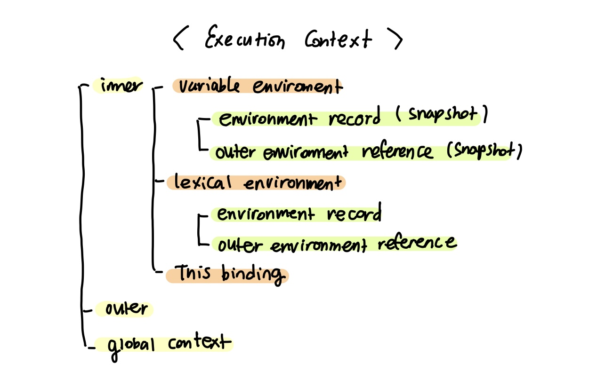
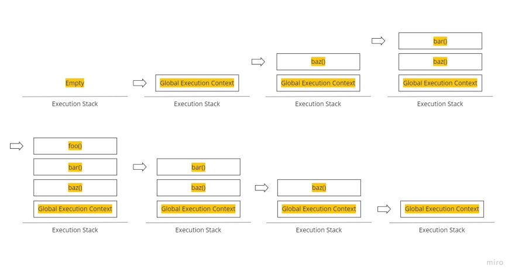

# 실행 컨텍스트란

- 실행 컨텍스트는 `자바스크립트 코드가 실행되는 환경`입니다. 모든 JS코드는 실행 컨텍스트 내부에서 실행됩니다.
- 실행 컨텍스트는 실행할 코드에 제공할 환경 정보들을 모아놓은 객체입니다.
- `식별자 결정`을 더욱 효율적으로 하기 위한 수단입니다.

## 실행 컨텍스트 종류

- Global Execution Context (전역 실행 컨텍스트)
  - 브라우저의 경우, window 객체, Node.js경우엔 global 객체가 곧 전역 실행 컨텍스트입니다.
- Functional Execution Context (함수 실행 컨텍스트)
  - 함수가 실행될 때마다 만들어지는 실행 컨텍스트입니다. 각 함수는 고유의 실행 컨텍스트를 가지며, 함수가 실행되거나 call 될때만 생성됩니다.
- Eval Function Execution Context
  - eval 함수로 실행되는 코드입니다.

## 실행 컨텍스트 실행 시점

실행 컨텍스트를 만들 수 있는 방법으로는 1. 전역공간, 2. 함수, 3.eval 함수가 있는데, 자동으로 생성되는 전역공간과 eval을 제외하면 실행 컨텍스트가 생성되는 시점은 곧 `함수를 실행하는 시점`입니다.

## 실행 컨텍스트 구조

실행 컨텍스트 내부엔 `Variable Environment`, `Lexical Environment`, `this binding`이 있습니다.



- VariableEnvironment
  현재 컨텍스트 내의 식별자들에 대한 정보 + 외부 렉시컬 환경에 대한 참조를 담습니다.
  - environmentRecord: 내부 식별자 정보 (매개변수 이름, 함수 선언, 변수명)을 수집합니다.
  - outerEnvironmentReference: 외부 렉시컬 환경에 대한 참조를 생성합니다.
- LexicalEnvironment
  처음에는 VariableEnvironment와 같지만 변경사항이 실시간으로 반영됩니다. 즉, VariableEnvironment는 초기 상태를 기억하고, LexicalEnvironment는 최신 상태를 저장하고 있습니다.
  - environmentRecord: 함수 안의 코드가 실행되기 전에 현재 컨텍스트와 관련된 코드의 식별자 정보가 저장됩니다. 즉, 코드가 실행되기 전에 자바스크립트 엔진은 이미 해당 환경에 속한 코드의 변수명 등을 모두 알고 있게 됩니다. (호이스팅)
  - outerEnvironmentReference (외부 렉시컬 환경에 대한 참조): `상위 스코프`를 가리킵니다. 즉, 현재 environmentRecord보다 바깥에 있는 environmentRecord를 참고한다는 뜻이며 해당 실행 컨텍스트를 생성한 함수의 바깥 환경을 가리킵니다. 만약 상위 스코프에서도 해당 식별자를 찾을 수 없다면 참조 에러(uncaught reference error)를 발생시킵니다.
- this binding
  - this는 현재 컨텍스트를 가리킵니다. method에서 사용시 해당 method가 담겨있는 instance나 object를 가르키며, 함수 표현식에서 사용시 this를 바인딩 하지 않는 이상 전역 객체를 가르킵니다.

**💡`LexicalEnvironment` 렉시컬 환경(어휘적 환경)**

렉시컬 환경은 식별자와 식별자에 바인딩된 값, 그리고 상위 스코프에 대한 참조를 기록하는 자료구조로 실행 컨텍스트를 구성하는 컴포넌트입니다. 실행 컨텍스트 스택이 코드의 실행순서를 관리한다면 `렉시컬 환경은 스코프와 식별자를 관리`합니다. 렉시컬 환경은 키와 값을 갖는 객체 형태의 스코프를 생성해서, 식별자를 키로 등록하고 식별자에 바인딩된 값을 관리한다.

**💡`scope chain` 스코프 체인**

찾으려는 식별자가 현재 있는 context에 존재하지 않는다면 outerEnvironmentReference가 가리키는 바깥 렉시컬 환경으로 가서 다시 해당 식별자를 찾게 됩니다. 식별자를 찾을 때 까지 타고 타고 가다가 최상위 스코프인 전역 렉시컬 환경에서도 찾지 못한다면 reference error를 발생시킵니다. 이렇게 식별자를 결정할 때 활용하는 스코프들의 연결리스트를 스코프 체인이라고 하고 식별자를 결정하기 위해 타고 타고 가서 찾는 과정을 스코프 체이닝 이라고 합니다.

## EC Stack

EC stack은 앞서 말한대로 Global Excution Context가 먼저 쌓이고, 그 위로 함수가 실행되면 실행컨텍스트가 생성이 되고 그 위로 쌓입니다. 실행 컨텍스트는 call stack이라는 통에 담기는데 stack은 이름에서도 알다싶이, 나중에 들어간 컨텍스트가 제일 빨리 처리되는 형태임을 알 수 있다. 그렇게 또 다시 호출되면 실행했던 실행 컨텍스트를 멈추고 새로운 함수의 컨텍스트를 생성하고 쌓고 다 처리하면 없어지고 결국 Global Excution Context까지 없어지게 됩니다.

```jsx
console.log("global execution context");

function foo() {
  console.log("foo is executing");
  console.log("foo has finished executing");
}

function bar() {
  console.log("bar is executing");
  foo();
  console.log("bar has finished executing");
}

function baz() {
  console.log("baz is executing");
  bar();
  console.log("baz has finished executing");
}

baz();
console.log("program successfully executed");

// Global execution context

// global execution context
// baz is executing
// bar is executing
// foo is executing
// foo has finished executing
// bar has finished executing
// baz has finished executing
// program successfully executed
```



### reference

[https://velog.io/@edie_ko/js-execution-context](https://velog.io/@edie_ko/js-execution-context)

[https://www.youtube.com/watch?v=EWfujNzSUmw&t=3s](https://www.youtube.com/watch?v=EWfujNzSUmw&t=3s)

[https://gamguma.dev/post/2022/04/js_execution_context](https://velog.io/@edie_ko/js-execution-context)
