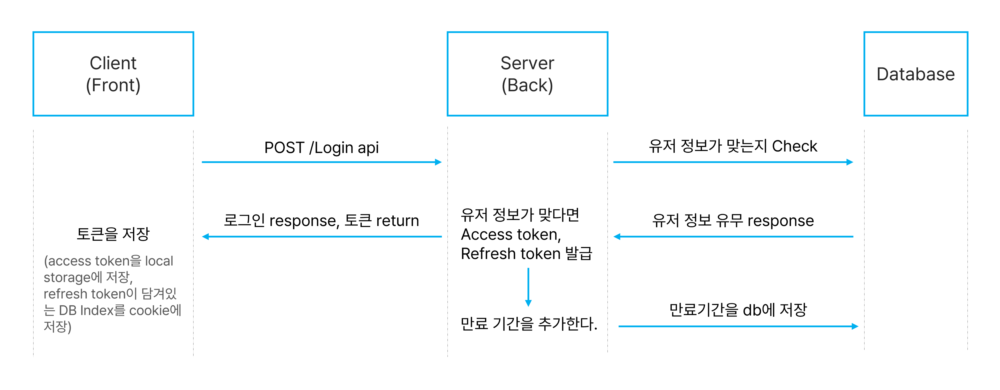
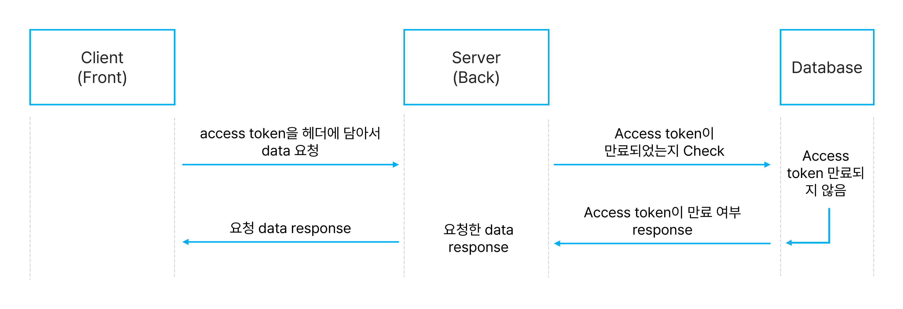
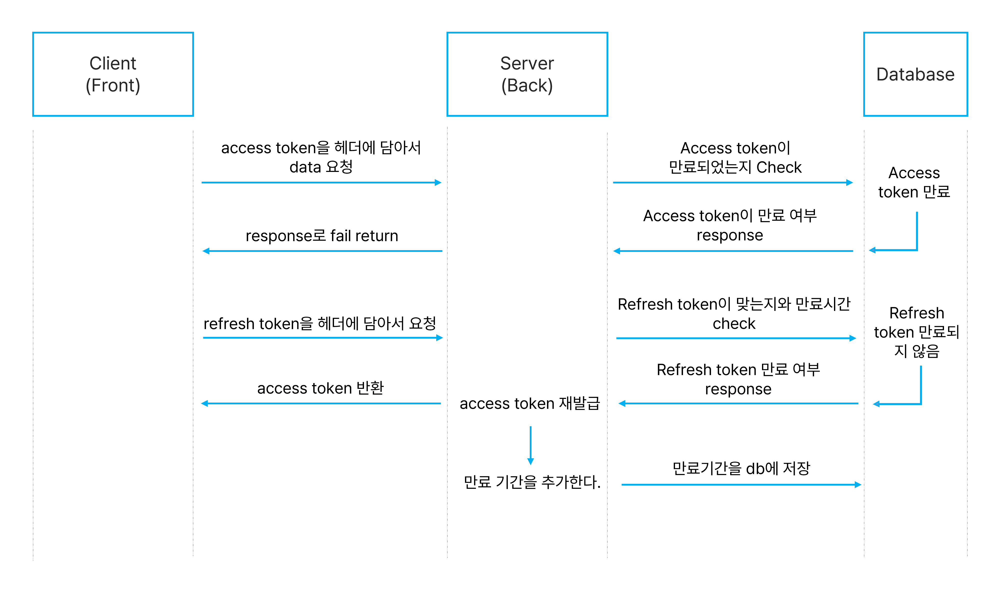

## JWT(Json Web Token)

jwt는 사용자 인증을 처리하는 방법중 하나이다. 인증받은 사용자들에게 토큰을 발급하고, 서버에 요청을 할 때 헤더에 토큰을 함께 보내도록 하여 유효성을 검사하는 방법이다.

### 장점

- 클라이언트 측에 저장되기 때문에 확장하기 적합하고 트래픽 대한 부담이 낮다.
- 트래픽이 많아졌을때 서버 자원을 절약할 수 있다. 서버의 부하를 줄일 수 있다.

### 단점

- 외부 공격자가 접근하기 쉽고, 정보가 노출이 가능하다.
- 암호화가 풀릴 가능성이 있다. → 암호화가 풀리더라도 토큰을 사용할 수 없도록 만료기간을 짧게 설정한다. (짧게는 5,6분 길게는 1시간 정도)
- jwt는 상태를 저장하지 않기 때문에 한번 만들어지면 제어가 불가능하다. 토큰을 임의로 삭제하는 것이 불가능하므로 토큰 만료 시간을 꼭 넣어주어야 한다.

## 흐름

**로그인 요청: Token 발급**

**Data request flow (success) : 데이터 요청**

**Data request flow (fail) : 데이터 요청 실패 시 토큰 재발급**

### reference

[https://blog.work6.kr/527](https://blog.work6.kr/527)

[https://velog.io/@mygomi/TIL-50-JWT에-대해-발표해보겠습니다](https://velog.io/@mygomi/TIL-50-JWT%EC%97%90-%EB%8C%80%ED%95%B4-%EB%B0%9C%ED%91%9C%ED%95%B4%EB%B3%B4%EA%B2%A0%EC%8A%B5%EB%8B%88%EB%8B%A4)
