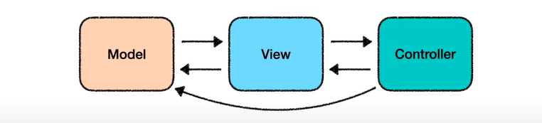
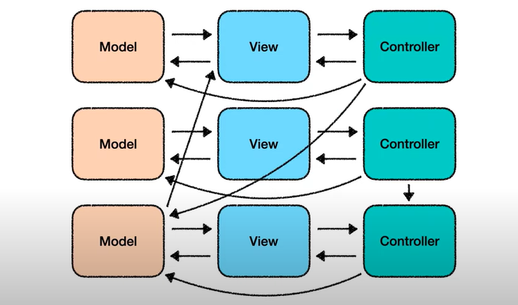
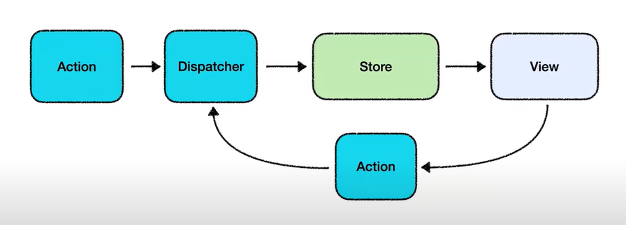
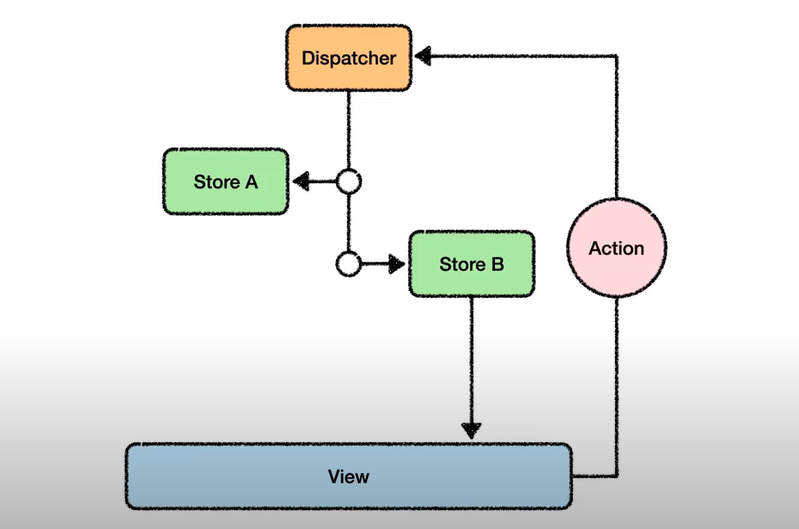

# Flux 아키텍쳐

## Flux 등장 배경

MVC 패턴은 확장하면 할수록 복잡해지기 때문에

### MVC 패턴



MVC 패턴은 이런식으로 양방향으로 데이터를 전달합니다. 가장 이상적인 모습의 MVC 패턴인데요. 실제 어플리케이션은 이런식으로 생겼습니다.



한눈으로 봐도 훨씬 복잡해졌고 흐름을 파악하기 어려워졌습니다. 이러한 어플리케이션에 새로운 기능을 추가한다면 쉽지않을 것입니다.

이러한 MVC에 한계를 느낀 페이스북은 데이터가 한 방향으로만 흐르는 아키텍쳐를 고안해냅니다. 그것이 Flux 아키텍쳐 입니다.

## Flux란?

`단방향 데이터 흐름`을 통해 보다 `예측가능`하게 상태를 관리할 수 있는 클라이언트 사이드 웹 어플리케이션 아키텍쳐



화살표가 항상 Dispatcher를 거쳐 사이클을 이루며 흐릅니다.



### Action

상태 변경 요청을 담은 자바스크립트 객체

- 액션 이름 (type)
- 데이터(payload)
- Action 생성자
  - Action을 쉽게 만들어주는 도우미

```jsx
{
	type: '새로운 메시지 도착',
	payload: {
			id: ...,
			message: '오늘 점심 메뉴 뭐 먹을까?',
			threadId: ...,
		}
}
```

### Dispatcher

모든 데이터 변경 요청이 경유하는 중앙 허브

- View로부터 Action을 받아 모든 Store들에게 전송
- 내부에 상태 변경 로직이 존재하지 않음
- Store간 의존성 관리
  - Store A의 상태 변경 순서를 Store B 다음으로 미룰 수 있음

### Store(Model)

어플리케이션 상태 및 로직 컨테이너

- Dispatcher에서 전달된 Action을 통해서만 상태 변경
- 상태가 변경되면 View에게 통지

### View

- Controller-view (React)
  - Store가 통지하는 상태 변경을 수신, 받은 상태에 따라 View를 새로 렌더링
- Dispatcher에게 Action 전달

## 장점과 한계점

### 장점

- 데이터 흐름 구조화
- 쉬운 유닛 테스트

### 단점

- 높은 학습 곡선
- 장황한 문법

### Reference

[https://www.youtube.com/watch?v=wQFBgKl1PYw](https://www.youtube.com/watch?v=wQFBgKl1PYw)
