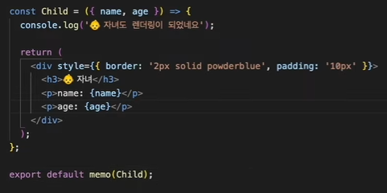
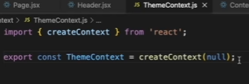
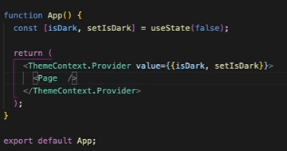
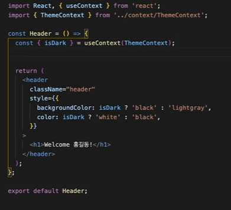
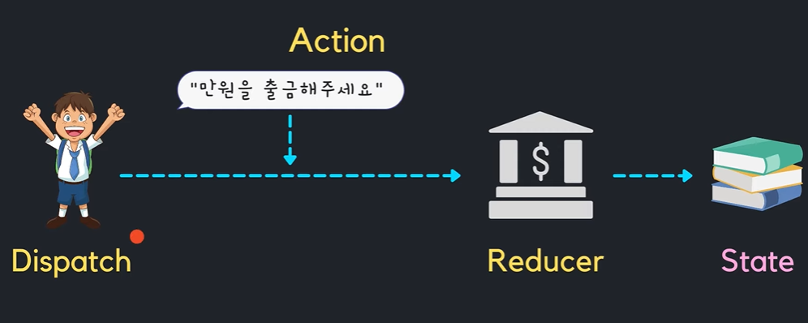
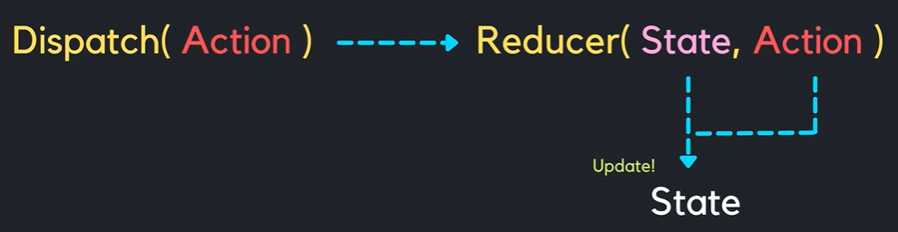
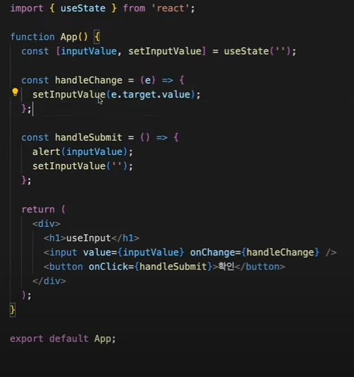

# 상태관리 도구

## useReducer

useState, useReducer둘은 같은 기능을 한다.

|       | useState                 | useReducer                                                                                                                                                                                           |
| ----- | ------------------------ | ---------------------------------------------------------------------------------------------------------------------------------------------------------------------------------------------------- |
| 장점  | 간단하다                 | - 예측 가능하고 일관되게 작동하며, 그래서 복잡한 상태를 관리하는데 적합합니다.<br/> - 테스트를 하기 쉽다. <br/>- 실행 취소/ 다시 실행, 상태 지속성 등과 같은 헬퍼 함수는 리듀서로 구현하기가 더 쉽다 |
| 단점  | 복잡한 상태관리는 힘들다 | 복잡하지 않은 상태를 관리해야 할때는 비추                                                                                                                                                            |
| 언제? | 간단한 state에서 사용    | - 관리해야할 state가 복수인 경우<br/> - 스케일이 큰 플젝<br/>- 복잡한 state 구조                                                                                                                     |

## **useState**

```jsx
import React, { useState } from "react";
import styled from "@emotion/styled";

function Sub1() {
  const [count, setCount] = useState(0);

  const down = () => {
    setCount(count - 1);
  };

  const reset = () => {
    setCount(0);
  };

  const up = () => {
    setCount(count + 1);
  };

  return (
    <Wrapper>
      <input type="button" value="-" onClick={down} />
      <input type="button" value="0" onClick={reset} />
      <input type="button" value="+" onClick={up} />
      <p>{count}</p>
    </Wrapper>
  );
}

const Wrapper = styled.div`
  height: 1000px;
  /* height: auto; */
  margin-top: 60px;
  background-color: lightcyan;
`;

export default Sub1;
```

## **useReducer**

```jsx
import React, { useReducer } from "react";
import styled from "@emotion/styled";

function Sub1() {
  function countReducer(oldCount, action) {
    if (action === "UP") {
      return oldCount + 1;
    }
    if (action === "DOWN") {
      return oldCount - 1;
    }
    if (action === "RESET") {
      return 0;
    }
    return oldCount;
  }
  const [count, countDispatch] = useReducer(countReducer, 0);

  const down = () => {
    countDispatch("DOWN");
  };

  const reset = () => {
    countDispatch("RESET");
  };

  const up = () => {
    countDispatch("UP");
  };

  return (
    <Wrapper>
      <input type="button" value="-" onClick={down} />
      <input type="button" value="0" onClick={reset} />
      <input type="button" value="+" onClick={up} />
      <p>{count}</p>
    </Wrapper>
  );
}

const Wrapper = styled.div`
  height: 1000px;
  /* height: auto; */
  margin-top: 60px;
  background-color: lightcyan;
`;

export default Sub1;
```

## **useState + useReducer**

```jsx
import React, { useReducer, useState } from "react";
import styled from "@emotion/styled";

function Sub1() {
  const [number, setNumber] = useState(1);

  function countReducer(oldCount, action) {
    if (action.type === "UP") {
      return oldCount + action.number;
    }
    if (action.type === "DOWN") {
      return oldCount - action.number;
    }
    if (action.type === "RESET") {
      return 0;
    }
    return oldCount;
  }

  const [count, countDispatch] = useReducer(countReducer, 0);

  const down = () => {
    countDispatch({ type: "DOWN", number });
  };

  const reset = () => {
    countDispatch({ type: "RESET", number });
  };

  const up = () => {
    countDispatch({ type: "UP", number });
  };

  const changeNumber = (event) => {
    setNumber(Number(event.target.value));
  };

  return (
    <Wrapper>
      <input type="button" value="-" onClick={down} />
      <input type="button" value="0" onClick={reset} />
      <input type="button" value="+" onClick={up} />
      <input type="text" value={number} onChange={changeNumber} />
      <p>{count}</p>
    </Wrapper>
  );
}

const Wrapper = styled.div`
  height: 1000px;
  /* height: auto; */
  margin-top: 60px;
  background-color: lightcyan;
`;

export default Sub1;
```

---

# Prop관리 훅

### context api

prop을 전역적으로 공유하게 해주는 기능이다.

```jsx
// App.jsx
import { useState, createContext } from "react";
import GrandParent from "./components/GrandParent";

export const MyContext = createContext(); // context 생성

function App() {
  return (
    <div className="App">
      <div className="card">
        <MyContext.Provider value="dasom">
          // 1. app.jsx에서 value 바인딩
          <GrandParent /> // 2. 이제 하위의 컴포넌트들에서 접근이 가능하다.
        </MyContext.Provider>
      </div>
    </div>
  );
}

// GrandParent.jsx
function GrandParent() {
  return <Parent />;
}

// Parent.jsx
function Parent() {
  return <Child />;
}

// Child.jsx
import { useContext } from "react";
import { MyContext } from "../App";

function Child() {
  const value = useContext(MyContext); // 3. 접근할땐 value 이렇게
  return <div>name is {value}</div>;
}
```

### useContext + useState

store/app-context.js - app context를 만든다.

```jsx
/* eslint-disable react/jsx-no-constructed-context-values */
import React, { useState, useEffect, useCallback } from "react";

const TestContext = React.createContext({
  data: "",
  setData: (data) => {},
});

export function TestContextProvider({ children }) {
  const [data, setData] = useState();
  const setDataHandler = (newData) => {
    console.log(newData);
    setData(newData);
  };

  const contextValue = {
    data,
    setData: setDataHandler,
  };

  return (
    <TestContext.Provider value={contextValue}>{children}</TestContext.Provider>
  );
}

export default TestContext;
```

Sub2.jsx - provider로 안에 넣을 컴포넌트를 감싸준다.

```jsx
import React from "react";
import { TestContextProvider } from "../store/app-context";
import Sub3 from "./Sub3";
import Sub4 from "./Sub4";

function Sub2() {
  return (
    <div>
      <p>Sub2</p>
      <TestContextProvider>
        <Sub3 />
        <Sub4 />
      </TestContextProvider>
    </div>
  );
}

export default Sub2;
```

Sub3.jsx - 버튼을 누르면 setData가 바뀐다.

```jsx
import React, { useContext } from "react";
import styled from "@emotion/styled";
import TestContext from "../store/app-context";

function Sub3() {
  const { data, setData } = useContext(TestContext);

  const onClickHandler = () => {
    setData("clicked");
  };

  return (
    <Wrapper>
      <p>Sub3</p>
      <button type="button" onClick={onClickHandler}>
        버튼
      </button>
      <p>{data}</p>
    </Wrapper>
  );
}

const Wrapper = styled.main`
  height: 100px;
  margin-top: 60px;
`;

export default Sub3;
```

Sub4.jsx - Sub3에서 버튼을 누르면 data도 같이 바뀐다.

```jsx
import React, { useContext } from "react";
import styled from "@emotion/styled";
import TestContext from "../store/app-context";

function Sub4() {
  const { data, setData } = useContext(TestContext);

  return (
    <Wrapper>
      <p>Sub4</p>
      <p>{data}</p>
    </Wrapper>
  );
}

const Wrapper = styled.main`
  height: 100px;
  margin-top: 60px;
`;

export default Sub4;
```

---

# React hooks

## useEffect

불필요한 렌더링을 막기 위해 사용한다. 의존성 배열 안에 있는 것들이 바뀌면 useEffect의 콜백이 실행된다.

```jsx
import React, { useEffect, useState } from "react";
import styled from "@emotion/styled";

function Sub5() {
  const [count, setCount] = useState(1);
  const [name, setName] = useState("");

  const handleCount = () => {
    setCount(count + 1);
  };

  const handleName = (event) => {
    setName(event.target.value);
  };

  useEffect(() => {
    console.log("랜더링 🎨");
    // count가 업데이트 될 때만 렌더링!
  }, [count]);

  return (
    <Wrapper>
      <p>Sub5</p>
      <button type="button" onClick={handleCount}>
        Update
      </button>
      <span>count : {count}</span>
      <br />
      <br />
      <input type="text" value={name} onChange={handleName} />
      <span>name : {name}</span>
    </Wrapper>
  );
}

const Wrapper = styled.main`
  height: 100px;
  margin-top: 60px;
`;

export default Sub5;
```

useEffect의 return 함수는 정리작업을 해주는 함수이다

## React.memo

`React.memo는 오직 PROPS 변화에만 의존하는 최적화 방법이다!`

- 상위 컴포넌트가 렌더링이되면 하위 컴포넌트는 무조건 렌더링이 되는데 그럴필요가 없고 props만 변경됐을 때 렌더링을 해줘도 괜찮다. 그때 사용하는게 React.memo이다.
- 무분별한 사용은 성능에 독이된다.

**언제 사용?**

1. 컴포넌트가 같은 props로 자주 렌더링 될때
2. 컴포넌트가 렌더링이 될 때마다 복잡한 로직을 처리해야 한다면



자식한테 memo, Parent useCallback, useMemo

## useRef

- ref는 저장공간이다.
- `ref가 변화되어도 컴포넌트가 렌더링이 되지 않는다`. (state가 변화되면 재랜더링이 된다)
- state가 변화되어 렌더링이 되어도 ref값은 유지된다.
- `DOM 요소에 접근`하고 싶을 때 사용한다. (예 : input.focus(), 마치 Doucment.querySelector())

즉, 언제 사용하냐면~ 랜더링 되어도 계속 값을 유지하고 싶거나 값이 변해도 렌더링하고싶지 않을때, DOM 요소에 접근하고 싶을 때 사용한다.

## useContext

prop drilling 방지

themeContex.js



app.js


하위 컴포넌트



## useMemo

- `값`을 기억해둔다!
- 컴포넌트 성능을 최적화하는데 대표적인 훅 : useMemo, useCallback
- **메모이제이션?** 자주 필요한 값을 맨 처음 계산할 때 `캐싱`을 해 두어, 그 값이 필요할 때마다 캐시에서 꺼내서 사용하는 것
- 기억해야할 것? 함수형 컴포넌트가 랜더링이 된다는 것은 component의 호출을 뜻한다. → 함수는 호출될 때마다 모든 내부 변수가 초기화된다

  ```jsx
  function Component() {
    const value = calculate();
    return <div>{value}</div>;
  }
  ```

  Component가 리랜더링 될 때마다 component 함수가 호출되고 calculate() 함수가 반복적으로 호출된다.
  **useMemo가 필요한 예제**

  ```jsx
  /* eslint-disable no-plusplus */
  /* eslint-disable no-empty */
  import React, { useState } from "react";
  import styled from "@emotion/styled";

  const hardCalculate = (number) => {
    console.log("어려운 계산 계산중 ... ");
    for (let i = 0; i < 809999999; i++) {} // 임의로 오래걸리는 계산을 걸어둠
    return number + 10000;
  };

  const easyCalculate = (number) => {
    console.log("쉬운 계산 계산중 ... ");
    return number + 1;
  };

  function Sub6() {
    const [hardNumber, setHardNumber] = useState(1);
    const [easyNumber, setEasyNumber] = useState(1);

    // const hardSum = hardCalculate(hardNumber);
    // 🚩use memo 추가
    const hardSum = useMemo(() => hardCalculate(hardNumber), [hardNumber]);
    const easySum = easyCalculate(easyNumber);

    return (
      <Wrapper>
        <p>Sub6</p>
        <h3>어려운 계산기</h3>
        <input
          type="number"
          value={hardNumber}
          onChange={(e) => setHardNumber(Number(e.target.value))}
        />
        <span> + 10000 = {hardSum}</span>

        <h3>쉬운 계산기</h3>
        <input
          type="number"
          value={easyNumber}
          onChange={(e) => setEasyNumber(Number(e.target.value))}
        />
        <span> + 1 = {easySum}</span>
      </Wrapper>
    );
  }

  const Wrapper = styled.main`
    height: 100px;
    margin-top: 60px;
  `;

  export default Sub6;
  ```

  hardCalculate()에 긴 시간이 걸리는 연산을 걸어두었다. easyCalculate를 수행할때 컴포넌트는 재랜더링 되고 hardCalculate() 함수도 실행하게되어 딜레이가 발생한다.! 이때 사용할 수 있는게 useMemo이다.
  useMemo를 통해 easySum계산에서는 이제 hardCalculate가 실행되지 않게끔 구현

  ***

  실제로는 객체타입을 useEffect할때 많이 사용한다. 아래 예제를 보자.

  ```jsx
  /* eslint-disable no-plusplus */
  /* eslint-disable no-empty */
  import React, { useMemo, useEffect, useState } from "react";
  import styled from "@emotion/styled";

  function Sub7() {
    const [number, setNumber] = useState(0);
    const [isKorea, setIsKorea] = useState(true);

    // const location = isKorea ? "한국" : "외국";
    // const location = { country: isKorea ? "한국" : "외국" };
    const location = useMemo(() => {
      return {
        country: isKorea ? "한국" : "외국",
      };
    }, [isKorea]);

    // location이 참조하고있는 주소가 바뀌어서 number를 수정해도 업데이트된다.
    // 이럴때 useMemo를 사용해서 현재 바라보고있는 참조값의 값인 isKorea가 변할때만 실행되게끔 만든다.

    useEffect(() => {
      console.log("useEffect 호출");
    }, [location]);

    return (
      <Wrapper>
        <p>Sub7 - useMemo 예제</p>
        <br />
        <p>하루에 몇끼 먹어요?</p>
        <input
          type="number"
          value={number}
          onChange={(e) => setNumber(e.target.value)}
        />
        <hr />
        <br />
        <p>어느 나라에 있어요?</p>
        <p>나라: {location.country}</p>
        <button type="button" onClick={() => setIsKorea(!isKorea)}>
          비행기 타자
        </button>
      </Wrapper>
    );
  }

  const Wrapper = styled.main`
    height: auto;
    margin-top: 60px;
  `;

  export default Sub7;
  ```

  location이 참조하고있는 주소가 바뀌어서 number를 수정해도 업데이트된다. 이럴때 useMemo를 사용해서 현재 바라보고있는 참조값의 값인 isKorea가 변할때만 실행되게끔 만든다.

## useCallback

- 컴포넌트의 성능을 최적화 시켜주는 도구
- `콜백함수 그 자체`를 메모이제이션 한다.

useCallback을 사용해야하는 예제를 보자

```jsx
import React, { useState, useEffect } from "react";
import styled from "@emotion/styled";

function Sub8() {
  const [number, setNumber] = useState(0);

  const someFunction = () => {
    console.log(`someFunc: number: ${number}`);
  };

  useEffect(() => {
    console.log("someFunction이 변경되었습니다.");
  }, [someFunction]);

  return (
    <Wrapper>
      <p>Sub8 - useCallback 예제</p>
      <input
        type="number"
        defaultValue={number}
        onChange={(e) => setNumber(e.target.value)}
      />
      <br />
      <button type="button" onClick={someFunction}>
        Call someFunc
      </button>
    </Wrapper>
  );
}

const Wrapper = styled.main`
  height: auto;
  margin-top: 60px;
`;

export default Sub8;
```

someFunction은 함수 객체의 메모리 주소를 가지고 있고 해당 컴포넌트가 랜더링이되서 초기화가 되면 someFunction은 새로 만들어져서 함수 객체의 메모리주소가 달라진다. setState로 컴포넌트를 재렌더링을 하면 someFunction의 주소가 달라지고 계속 호출이 된다. 이때 사용하는 것이 useCallback이다.

```jsx
import React, { useState, useEffect, useCallback } from "react";
import styled from "@emotion/styled";

function Sub8() {
  const [number, setNumber] = useState(0);

  const someFunction = useCallback(() => {
    console.log(`someFunc: number: ${number}`);
  }, [number]);

  // const someFunction = () => {
  //   console.log(`someFunc: number: ${number}`);
  // };

  useEffect(() => {
    console.log("someFunction이 변경되었습니다.");
  }, [someFunction]);

  return (
    <Wrapper>
      <p>Sub8 - useCallback 예제</p>
      <input
        type="number"
        defaultValue={number}
        onChange={(e) => setNumber(e.target.value)}
      />
      <br />
      <button type="button" onClick={someFunction}>
        Call someFunc
      </button>
    </Wrapper>
  );
}

const Wrapper = styled.main`
  height: auto;
  margin-top: 60px;
`;

export default Sub8;
```

다른 예제

```jsx
import React, { useState, useEffect, useCallback } from "react";
import styled from "@emotion/styled";
/**
 * Theme이 리랜더링 되면 createBoxStyle도 리랜더링이 된다.
 * 이걸 방지하기 위해 useCallback사용하기
 *
 */

function Sub9() {
  const [size, setSize] = useState(100);
  const [isDark, setIsDark] = useState(false);

  const createBoxStyle = useCallback(() => {
    return {
      backgroundColor: "pink",
      width: `${size}px`,
      height: `${size}px`,
    };
  }, [size]);

  // const createBoxStyle = () => {
  //   return {
  //     backgroundColor: "pink",
  //     width: `${size}px`,
  //     height: `${size}px`,
  //   };
  // };

  return (
    <Wrapper style={{ background: isDark ? "black" : "white" }}>
      <p>Sub9 - useCallback 실용적인 예제</p>
      <input
        type="number"
        value={size}
        onChange={(e) => setSize(e.target.value)}
      />
      <button type="button" onClick={() => setIsDark(!isDark)}>
        change theme
      </button>
      <Box createBoxStyle={createBoxStyle} />
    </Wrapper>
  );
}

function Box({ createBoxStyle }) {
  const [style, setStyle] = useState({});

  useEffect(() => {
    console.log("박스 키우기 🎨");
    setStyle(createBoxStyle());
  }, [createBoxStyle]);

  return <div style={style} />;
}

const Wrapper = styled.main`
  height: auto;
  margin-top: 60px;
`;

export default Sub9;
```

## useReducer





---

## 커스텀 훅

### **useInput**

만들기 전



```jsx
import React from "react";
import styled from "@emotion/styled";
import { useInput } from "../hooks/useInput";

function displayMessage(message) {
  alert(message);
}

function Sub14() {
  const [inputValue, handleChange, handleSubmit] = useInput("", displayMessage);

  return (
    <Wrapper>
      <p>Sub14 - custom hook - useInput </p>
      <input value={inputValue} onChange={handleChange} />
      <button type="button" onClick={handleSubmit}>
        확인
      </button>
    </Wrapper>
  );
}

const Wrapper = styled.main`
  height: auto;
  margin-top: 60px;
  border: 2px solid navy;
  padding: 10px;
`;

export default Sub14;

/////////////////////////////////////////

import { useState } from "react";

export function useInput(initialValue, submitAction) {
  const [inputValue, setInputValue] = useState(initialValue);

  const handleChange = (e) => {
    setInputValue(e.target.value);
  };

  const handleSubmit = () => {
    setInputValue("");
    submitAction(inputValue);
  };

  return [inputValue, handleChange, handleSubmit];
}
```

### **useFetch**

useFetch 적용 전

```jsx
import React, { useEffect, useState } from "react";
import styled from "@emotion/styled";

const baseUrl = "https://jsonplaceholder.typicode.com";

function Sub15() {
  const [data, setData] = useState(null);

  const fetchUrl = (type) => {
    fetch(`${baseUrl}/${type}`)
      .then((res) => res.json())
      .then((res) => setData(res));
  };

  useEffect(() => {
    fetchUrl("users");
  }, []);

  console.log(data);

  return (
    <Wrapper>
      <p>Sub15 - custom hook - useFetch </p>
      <button type="button" onClick={() => fetchUrl("users")}>
        Users
      </button>
      <button type="button" onClick={() => fetchUrl("posts")}>
        Posts
      </button>
      <button type="button" onClick={() => fetchUrl("todos")}>
        Todos
      </button>
      <pre>{JSON.stringify(data, null, 2)}</pre>
    </Wrapper>
  );
}

const Wrapper = styled.main`
  height: auto;
  margin-top: 60px;
  border: 2px solid navy;
  padding: 10px;
`;

export default Sub15;
```

---

적용 후

```jsx
import React from "react";
import styled from "@emotion/styled";
import useFetch from "../hooks/useFetch";

const baseUrl = "https://jsonplaceholder.typicode.com";

function Sub15() {
  const { data, fetchUrl } = useFetch(baseUrl, "users");
  // console.log(data);

  return (
    <Wrapper>
      <p>Sub15 - custom hook - useFetch </p>
      <button type="button" onClick={() => fetchUrl("users")}>
        Users
      </button>
      <button type="button" onClick={() => fetchUrl("posts")}>
        Posts
      </button>
      <button type="button" onClick={() => fetchUrl("todos")}>
        Todos
      </button>
      <pre>{JSON.stringify(data, null, 2)}</pre>
    </Wrapper>
  );
}

const Wrapper = styled.main`
  height: auto;
  margin-top: 60px;
  border: 2px solid navy;
  padding: 10px;
`;

export default Sub15;

/////////////////////////////////////
import { useEffect, useState } from "react";

export default function useFetch(baseUrl, initialType) {
  const [data, setData] = useState(null);

  const fetchUrl = (type) => {
    fetch(`${baseUrl}/${type}`)
      .then((res) => res.json())
      .then((res) => setData(res));
  };

  useEffect(() => {
    fetchUrl(initialType);
  }, []);

  return {
    data,
    fetchUrl,
  };
}
```

### **useAxios**

[https://kunkunwoo.tistory.com/235](https://kunkunwoo.tistory.com/235)
