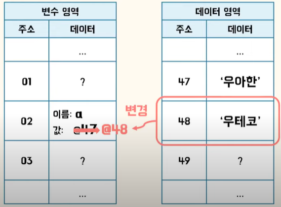
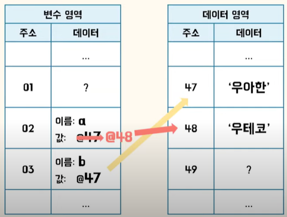
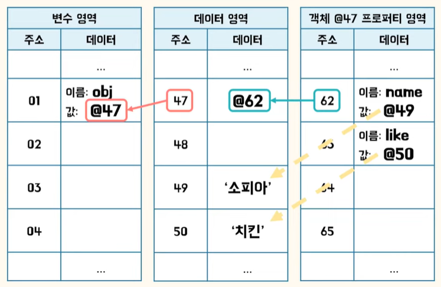
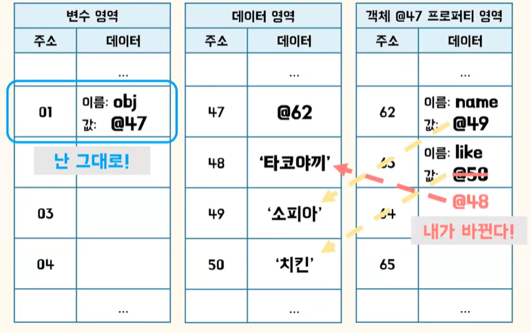
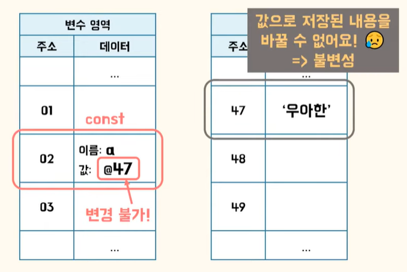
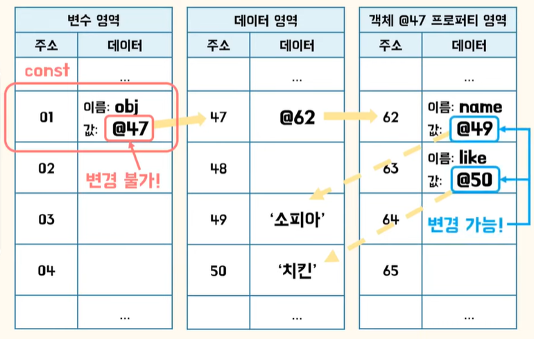
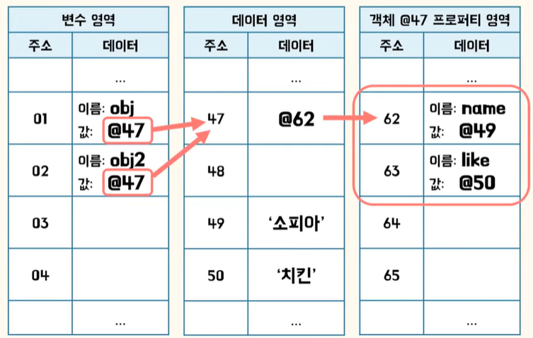

# 불변성

메모리 영역에서의 직접적인 변경을 하지 않고, 새로운 값을 만들어 변수의 주소를 바꾸는 것을 의미합니다.

## 데이터 타입

### Primitive type

`불변하다(Immutable)`

- Undefined
- Null
- Boolean
- String
- Number
- Symbol

### Object

`가변하다(Mutable)`

- Array
- Function
- Date
- RegExp

## Primitive type

### 변수를 변경할 때

```jsx
var a = "우아한";
a = "우테코";
```



변경이 일어나면 `기존 문자열`인 ‘우아한’은 `그대로 두고` 문자열 ‘우테코’를 새로운 공간에 저장합니다. 그리고 `변수가 가리키는 주소만 변경`합니다. 이후 아무도 찾지 않는 값은 공간의 효율을 위해 가비지 콜렉터에 의해 제거가 됩니다.

### 변수를 새 변수에 할당할 때

```jsx
var a = "우아한";
var b = a;
a = "우테코";
```



a, b 둘다 ‘우아한’을 가리킵니다. 그러다가 변수 a에 다른 문자열 ‘우테코’가 할당되면 `a가 들고있는 값만 다른 주소로 바뀝니다`.

데이터 타입에 따라 변수의 `값이 불변합니다`. 그리고 할당된 값이 메모리 공간에 저장되었을 때 `저장된 값 자체를 바꿀수가 없는 것`을 보고, 불변하다, immutable하다고 말합니다.

---

## Object type

### 변수를 선언하고 객체를 할당할 때

```jsx
var obj = {
  name: "소피아",
  like: "치킨",
};

obj.like = "타코야끼";
```





객체가 할당된 변수는 자신의 값을 그대로 들고 있으면서 `내부 프로퍼티가 기리키는 값을 변경할 수가 있습니다.` 이렇게 객체 내부 프로퍼티를 변경할 수 있는 부분을 두고 Object type은 가변하다, mutable하다고 말합니다.

## const vs 불변성?

**primitive type인 경우**

```jsx
const a = "우아한";
```



const : 변수가 들고 있는 값인 주소값을 수정할 수 없습니다.

불변성 : 값이 메모리에 저장이 되면 저장된 값을 바꿀 수 없습니다.

**Object type인 경우**

```jsx
const obj = {
  name: "소피아",
  like: "치킨",
};
```



변수가 들고있는 값은 바꾸지 못합니다. 하지만 const가 내부 프로퍼티 영역까지 제한하는 것은 아닙니다. 때문에 `객체 내부 프로퍼티에 재할당은 가능합니다.`

## 얕은 복사 vs 깊은 복사

### 객체에 새 객체를 할당할 때

```jsx
var obj = {
  name: "소피아",
  like: "치킨",
};

var obj2 = obj;
```



변수가 같은 값을 들고 있으니 하나를 바꾸면 다른 하나도 바뀌는 것이 당연한 것입니다. 원본이 변하지 않으려면 사본이 `새로운 프로퍼티 영역을 가리키도록` 해야합니다. 그리고 `내부 프로퍼티의 값을 전부 복사`해주어야 합니다.

**얕은 복사**

원본과 사본이 공유하는 영역이 하나라도 있습니다.

**깊은 복사**

원본과 사본이 전혀 다른 영역을 가집니다.

---

객체의 원본을 안전하게 보호하기 위해서는 재귀적으로 내부 프로퍼티가 객체인지 확인하고 그 내부 값을 모두 복사해주어야 합니다. 그외 lodash, Immutable.js, JSON을 이용한 방법이 있습니다.

### Reference

[https://www.youtube.com/watch?v=hM8s3ZaycGk](https://www.youtube.com/watch?v=hM8s3ZaycGk)
