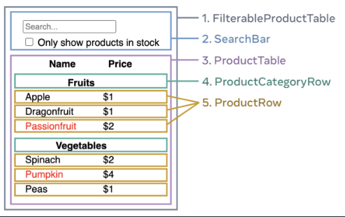

# 리엑트스럽게 구현하는 방법

이 글은 [리엑트 공식문서 - 리엑트로 사고하기](https://react-ko.dev/learn/thinking-in-react)를 정리한 글입니다.

## 전제조건

JSON API와 디자이너의 목업이 있다고 가정합니다.

```json
[
  { "category": "Fruits", "price": "$1", "stocked": true, "name": "Apple" },
  {
    "category": "Fruits",
    "price": "$1",
    "stocked": true,
    "name": "Dragonfruit"
  },
  {
    "category": "Fruits",
    "price": "$2",
    "stocked": false,
    "name": "Passionfruit"
  },
  {
    "category": "Vegetables",
    "price": "$2",
    "stocked": true,
    "name": "Spinach"
  },
  {
    "category": "Vegetables",
    "price": "$4",
    "stocked": false,
    "name": "Pumpkin"
  },
  { "category": "Vegetables", "price": "$1", "stocked": true, "name": "Peas" }
]
```


---

## Step1. UI를 컴포넌트 계층 구조로 나누기

- 모든 컴포넌트와 하위 컴포넌트의 이름을 지정합니다.



1. `FilterableProductTable` (회색)에는 전체 앱이 포함됩니다.
2. `SearchBar` (파란색)는 사용자 입력을 받습니다.
3. `ProductTable` (보라색)은 사용자 입력에 따라 목록을 표시하고 필터링합니다.
4. `ProductCategoryRow` (녹색)는 각 카테고리에 대한 제목을 표시합니다.
5. `ProductRow` (노란색)는 각 상품에 대한 행을 표시합니다.

- 계층 구조로 정렬합니다.

```json
- FilterableProductTable
    - SearchBar
    - ProductTable
        - ProductCategoryRow
        - ProductRow
```

---

## Step2. React로 정적인 UI 만들기

- 정적인 UI를 먼저 만들고 상호작용을 별도로 추가합니다.
  - state 사용하지 말기
  - 보통은 상위 컴포넌트부터 하위로 만듭니다. 그러나 대규모 프로젝트에서는 상향식으로 진행하는 것이 더 쉽습니다.

```jsx
function ProductCategoryRow({ category }) {
  return (
    <tr>
      <th colSpan="2">{category}</th>
    </tr>
  );
}

function ProductRow({ product }) {
  const name = product.stocked ? (
    product.name
  ) : (
    <span style={{ color: "red" }}>{product.name}</span>
  );

  return (
    <tr>
      <td>{name}</td>
      <td>{product.price}</td>
    </tr>
  );
}

function SearchBar() {
  return (
    <form>
      <input type="text" placeholder="Search..." />
      <label>
        <input type="checkbox" /> Only show products in stock
      </label>
    </form>
  );
}

function FilterableProductTable({ products }) {
  return (
    <div>
      <SearchBar />
      <ProductTable products={products} />
    </div>
  );
}

const PRODUCTS = [
  { category: "Fruits", price: "$1", stocked: true, name: "Apple" },
  { category: "Fruits", price: "$1", stocked: true, name: "Dragonfruit" },
  { category: "Fruits", price: "$2", stocked: false, name: "Passionfruit" },
  { category: "Vegetables", price: "$2", stocked: true, name: "Spinach" },
  { category: "Vegetables", price: "$4", stocked: false, name: "Pumpkin" },
  { category: "Vegetables", price: "$1", stocked: true, name: "Peas" },
];

export default function App() {
  return <FilterableProductTable products={PRODUCTS} />;
}
```

---

## Step3. state 찾기

DRY(Don't repeat yourself)를 지키며 state를 사용합니다.

**state ❌**

- 시간이 지나도 변하지 않는 값
- 부모로부터 props를 통해 전달되는 값
- 컴포넌트의 기존 state 또는 props를 가지고 계산할 수 있는 값

### state 찾는 방법

1. 예제 어플리케이션의 모든 데이터를 찾기

   1. 제품의 원본 목록
   2. 사용자가 입력한 검색어
   3. 체크박스의 값
   4. 필터링된 제품 목록

1. 찾은 데이터에서 state 찾기
   1. 제품 원본 목록은 **props로 전달되었으므로 state가 아닙니다**.
   2. 검색어는 시간에 따라 바뀌고 다른 것으로부터 계산할 수 없으므로 state로 볼 수 있습니다.
   3. 체크박스의 값은 시간에 따라 바뀌고 다른 것으로부터 계산할 수 없으므로 state로 볼 수 있습니다.
   4. 필터링된 제품 목록은 **원본 목록으로부터 검색어 및 체크박스 값을 조합하여 계산할 수 있으므로 state가 아닙니다**.

즉, 검색어 필드와 체크박스의 값만 state!

---

## Step4. State가 어디에 있어야 할지 파악하기

React는 컴포넌트 계층 구조를 따라 부모 컴포넌트에서 자식 컴포넌트로, 아래로 내려가는 단방향 데이터 흐름을 따릅니다.

### **state가 있어야 할 곳 찾는 방법**

1. state를 렌더링하는 모든 컴포넌트 찾기
2. 찾은 컴포넌트들의 가장 상위 컴포넌트 찾기

→ 보통 `공통 부모 컴포넌트`에 state를 두거나 `더 상위 컴포넌트`에 state를 둘 수 있습니다.

→ 적절한 상위 컴포넌트가 없다면 새 컴포넌트 추가하기

예제에서는, 검색어와 체크박스 값을 state로 둘건데 둘이 항상 함께 필요하므로 이 둘을 같은 위치게 두는 것이 이치에 맞습니다.

```json
- FilterableProductTable
    - SearchBar
    - ProductTable
        - ProductCategoryRow
        - ProductRow
```

둘의 공통 부모는 `FilterableProductTable`입니다. 따라서 filter text와 checked state 값을 해당 컴포넌트에 작성합니다.

```jsx
// 상위 컴포넌트에 state 선언
function FilterableProductTable({ products }) {
  const [filterText, setFilterText] = useState('');
  const [inStockOnly, setInStockOnly] = useState(false);
```

```jsx
// 하위 컴포넌트에게 props로 전달
<div>
  <SearchBar filterText={filterText} inStockOnly={inStockOnly} />
  <ProductTable
    products={products}
    filterText={filterText}
    inStockOnly={inStockOnly}
  />
</div>
```

---

## Step5. 역방향 데이터 흐름 추가하기

예제 코드는 하위 컴포넌트인 form 컴포넌트에서 상위 컴포넌트인 FilterableProductTable의 state를 업데이트를 해야 합니다. 즉, 역방향으로도 데이터가 흐를 수 있게 해야 합니다.

```jsx
// onFilterTextChange 주목
function FilterableProductTable({ products }) {
  const [filterText, setFilterText] = useState('');

  return (
    <div>
      <SearchBar
        filterText={filterText}
        inStockOnly={inStockOnly}
        onFilterTextChange={setFilterText}
    </div>
  );
}

function SearchBar({
  filterText,
  inStockOnly,
  onFilterTextChange,
  onInStockOnlyChange
}) {
  return (
    <form>
      <input
        type="text"
        value={filterText} placeholder="Search..."
        onChange={(e) => onFilterTextChange(e.target.value)} />
	);
}

```
