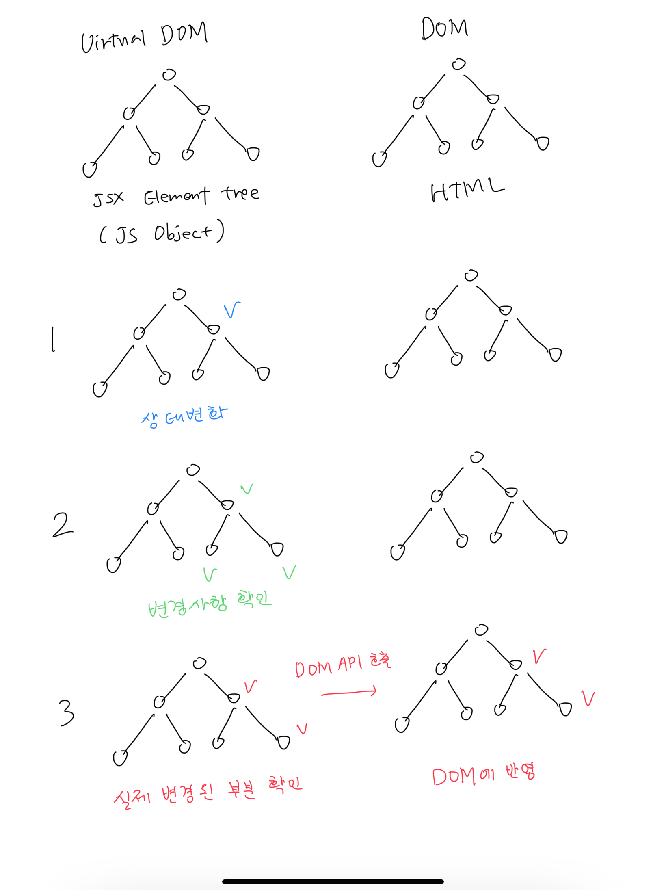

# Virtual DOM

## Virtual DOM 탄생 배경

기존에는 화면을 다시 그릴 때마다 jQuery나 document.getElementById, document.querySelector 등을 통해 DOM 노드를 검색하고 수정하거나 특정 위치에 노드를 추가하고 삭제를 했는데, 이렇게 DOM 노드에 CRUD 작업을 수행하는 것은 `비싼 작업`이기 때문에 Virtual DOM이라는 개념이 등장했습니다.

## Virtual DOM이란?

- virtual DOM은 일종의 DOM의 요약본입니다.
- virtual DOM은 HTML DOM의 추상화 버전입니다. real DOM과 같은 속성들은 가지고 있으나 api(getElementById, createElement)는 가지고있지 않습니다.

## Virtual DOM의 동작방식

vitrual DOM에 있던 내용과 업데이트 후에 내용을 비교하여 바뀐부분만 실제 DOM에 적용시킵니다. 즉, `virtual DOM에 변경사항이 반영되면 원본 DOM에 필요한 변화만 반영되어서 전체 real DOM을 바꾸지 않고도 필요한 UI 업데이트를 적용할 수 있습니다.`

### 💡Diffing

virtual DOM이 업데이트 되면, React는 virtual DOM을 업데이트 이전의 virtual DOM 스냅샷과 비교하여 정확히 어떤 virtualDOM이 바뀌었는지 검사하는 것입니다.

### Reference

[https://velog.io/@gwak2837/React-Virtual-DOM-이해하기](https://velog.io/@gwak2837/React-Virtual-DOM-%EC%9D%B4%ED%95%B4%ED%95%98%EA%B8%B0)

[https://www.youtube.com/watch?v=PN_WmsgbQCo](https://www.youtube.com/watch?v=PN_WmsgbQCo)
