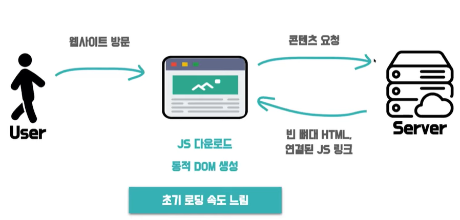
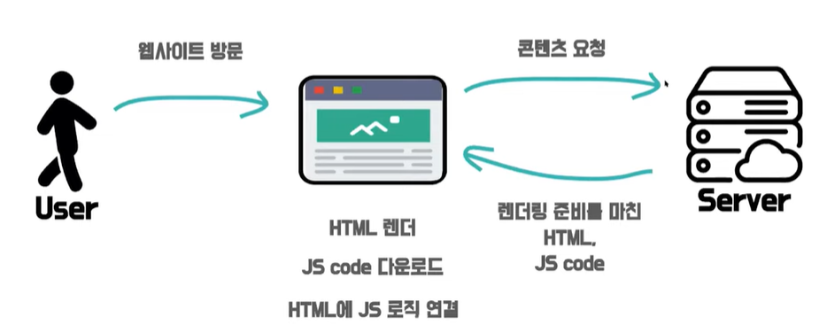
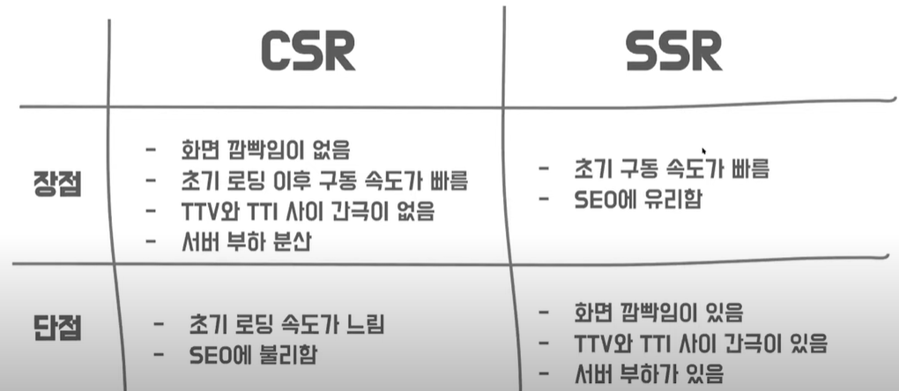

# CSR & SSR

## SPA(Single Page Application)

- 하나의 페이지로 구성된 웹 어플리케이션
- 웹 어플리케이션에 필요한 정적 리소스를 초반 한번에 모두 다운로드하고 그 이후 새로운 페이지 요청이 있을 때 필요한 데이터만 전달받아서 클라이언트에서 페이지를 갱신하기 때문에 렌더링 방식으로 `CSR`을 사용합니다.
- 예 : React, Angular, View

### MPA(Multi Page Application)

- 탭을 이동할 때마다 서버로부터 새로운 html을 새로 받아와서 페이지 전체를 새로 렌더링하는 전통적인 웹 페이지 구성 방식
- 새로운 요청이 있을 때 마다 서버에서 이미 렌더링된 정적 리소스를 받아오기 때문에 `SSR`를 사용합니다.
- php, jsp

# CSR VS SSR

client와 server 중 어느쪽에서 rendering을 준비하느냐

## CSR(Client Side Rendering)

- 클라이언트 측에서 렌더링을 하는 방식
- 동작방식

초기 로딩 속도는 느리지만 이후 구동 속도는 빠릅니다.

반응속도도 빠르고 ux가 우수합니다.

웹 크롤러 봇 입장에서 본 HTML은 텅텅 비어있기 때문에 SEO에 불리합니다.

## SSR(Server Side Rendering)

- 서버 측에서 렌더링을 하는 방식
- 요청할때 즉시 만드니까 데이터가 달라져서 미리 만들어뒤 어려운 페이지에 적

검색엔진 최적화에 유리합니다. 초기 구동 속도가 빠릅니다. TTV와 TTI 사이 간극이 있습니다.

💡`SSG(Static Site Generation)`

- 서버에서 요청 시에 즉시 만드느냐 미리 다 만들어놓느냐의 차이
- 미리 다 만들어두니까 바뀔 일이 거의 없는 페이지에 적합
- 예 : gatsby, wordPress

## CSR의 단점 보완 방법

### 초기 로딩 속도 보완

- code splitting
- tree-shaking
- chunk 분
- SSR, SSG 도입

### SEO 개선

- pre-rendering
- SSR, SSG 도입

## CSR + SSR/SSG

Isomorphic App

Universal Rendering

### without framework

nodeJS(express)를 사용하여 별도의 서버를 직접 운영

nestJS 사용

### with framework

- next.JS
- GatsbyJS
- NuxtJS
- Angular Universal

### Reference

[https://www.youtube.com/watch?v=YuqB8D6eCKE](https://www.youtube.com/watch?v=YuqB8D6eCKE)
