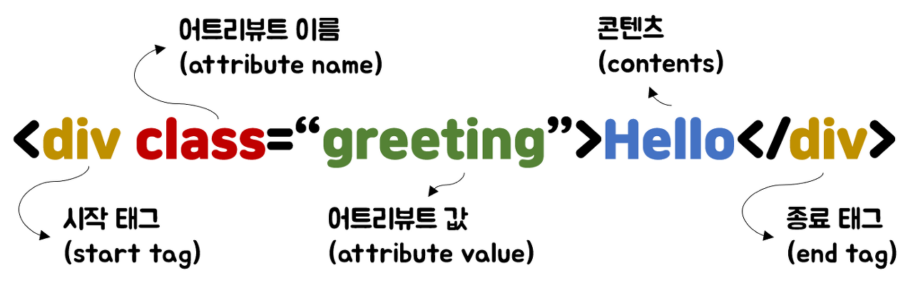
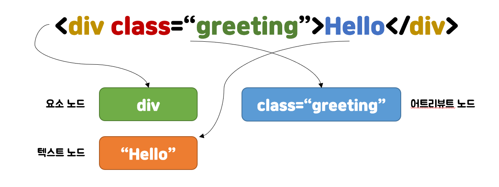
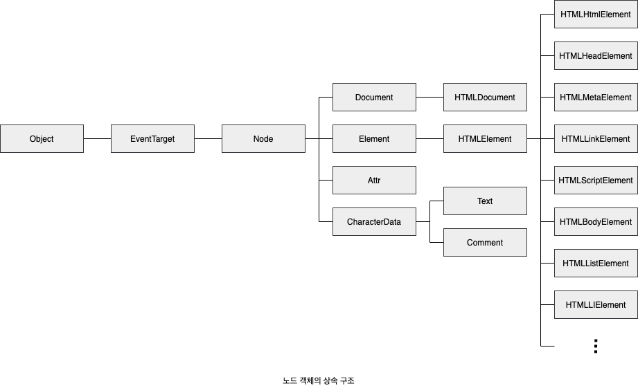
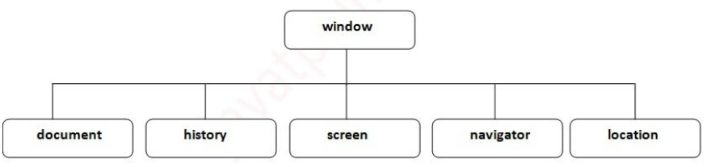

# DOM (Document Object Model)

- HTML 문서의 계층적 구조와 정보를 표현하며 이를 제어할 수 있는 API, 즉 프로퍼티와 메서드를 제공하는 트리 자료구조이다.
- 문서 객체란 <html>이나 <body>같은 html 문서 태그들을 js가 이용할 수 있는 객체로 만든 것이다.
- browser가 텍스트 파일로 만들어져 있는 웹 문서는 브라우저에 렌더링하기 위해서 브라우저가 이해할 수 있는 구조로 구성하는데 이를 DOM이라고 한다.
- DOM은 프로그래밍 언어가 DOM에 접근하고 수정할 수 있는 방법을 자바스크립트 객체로 제공하는데, 그것을 DOM API(Application Programming Interface)라고 부른다. 즉, 정적인 웹페이지에 접근하여 동적으로 웹페이지를 변경하기 위한 유일한 방법은 메모리 상에 존재하는 DOM을 변경하는 것이고, 이때 필요한 것이 DOM API이다.
- DOM은 문서에 대한 모든 내용을 담고 있는 객체이다.
- DOM은 텍스트 파일로 만들어진 문서를 브라우저가 이해할 수 있는 구조로 구성한 것
- HTML 요소 간의 부자 관계를 반영하여 모든 노드들을 트리 구조로 구성한 것

---

## 노드

HTML 요소는 HTML문서를 구성하는 개별적인 요소를 의미한다.

HTML 요소는 렌더링 엔진에 의해 파싱되어 DOM을 구성하는 요소 노드 객체로 변환된다. 이때 HTML 요소의 어트리뷰트는 어트리뷰트 노드로,

HTML요소의 텍스트 콘텐츠는 텍스트 노드로 변환된다.

### 문서 노드(document node)

- 최상위에 존재하는 루트 노드로서 document 객체를 가리킨다.
- 브라우저 환경의 모든 자바스크립트 코드는 하나의 전역객체 window를 공유한다. 따라서 모든 자바스크립트 코드는 전역 객체 window의 document 프로퍼티에 바인딩 되어 있는 하나의 document 객체를 바라본다. 즉, HTML 문서당 document 객체는 유일하다.
- 진입점 역할을 담당한다.

### 요소 노드(element node)

- HTML 요소를 가리키는 객체
- 문서의 구조를 표현한다

### 어트리뷰트 노드(attribute node)

- HTML 요소의 어트리뷰트를 가리키는 객체이다.
- 어트리뷰트 노드는 지정된 element 노드와 연결되어 있다. 단, element 노드는 부모 노드와 연결되어 있지만 attribute 노드는 element 노드에만 연결되어 있다. 따라서 attribute 노드를 참조하거나 변경하려면 element 노드에 접근해야 한다.

### 텍스트 노드 (text node)

- HTML 요소의 텍스트를 가리키는 객체
- DOM 트리의 최종단이다. 따라서 텍스트 노드에 접근하려면 부모노드인 요소 노드에 접근해야 한다.

## 노드 객체의 상속 구조

- DOM은 HTML 문서의 계층적 구조와 정보를 표현하며, 이를 제어할 수 있는 API, 즉 프로퍼티와 메서드를 제공하는 트리 자료구조라고 했다.
- DOM API를 통해서 노드 객체는 자신의 부모, 형제, 자식을 탐색할 수 있으며, 자신의 어트리뷰트와 텍스트를 조작할 수 있다.

## HTMLCollection과 NodeList

HTMLCollection과 NodeList은 유사 배열 객체이면서 이터러블이다. 따라서 for …of문으로 순회할 수 있으며 스프레드 문법을 사용하여 간단히 배열로 변환할 수 있다.

HTMLCollection과 NodeList의 중요한 특징은 노드 객체의 상태 변화를 실시간으로 반영하는 살아있는 객체라는 것이다.

## BOM?

Browser Object Model

- 웹 브라우저 환경의 다양한 기능을 객체처럼 다루는 모델
- 대부분의 브라우저에서 구현되어 있지만, 정의된 표준이 없어 브라우저 제작사마다 세부사항이 다르다
- `window` 객체는 자바스크립트의 최상위 객체이자 전역 객체이면서 모든 객체가 소속된 객체이다.
- 최상위 객체이기 때문에 생략이 가능하다
- var 키워드로 선언한 일반 변수도 모두 window 객체의 속성이 된다.
- DOM은 BOM에 포함된다.

---

### 성능?

DOM 조작을 최소화 하자
